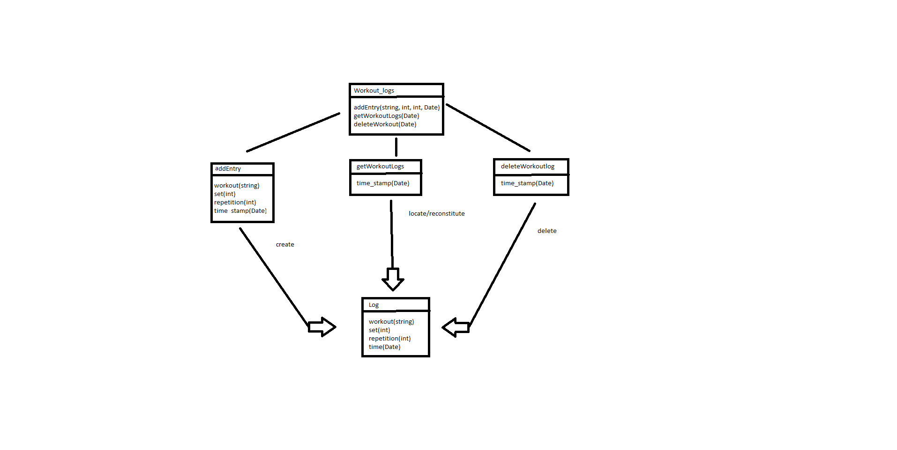

:pname: GamifiedGym

== 1. Informative part
=== 1.1 Team Composition
* Managers:
** Gian Gonzalez
** Kevin Lopez
** Ricardo Perez

* Fitness Tracker Team:
** Ernesto Soto (Team Leader)
** Cristian Massini
** Pedro Matos
** Cristian Barreras
** Nelson Caban
** Yandiel Hernandez
** Luis Sorrentini
** Michael Martinez

* Foundations Team:
** Reinaldo Martinez (Team Leader)
** Estefania Roca
** Lianette Alberto
** Christian Rodriguez
** Marcelo Perez
** Christian Medina
** Angel Ramos
** Kevin Ibarra
** Fernando Hidalgo

* Game Design Team:
** Emmanuel Guadalupe (Team Leader)
** Aliana Santiago
** Jorge Peralta
** Keishlyany Sanabria
** Diego Vazquez
** Kiam Perez
** Andrea Seda
** Samael Alvarez

=== 1.2 Current Situation, Needs, Ideas

==== 1.2.1 Current Situation

  The fitness application market is saturated with products that solely focus on data logging. Many users, particularly 
novices and those who struggle with commitment, are prone to finding these apps mundane. These applications act more as 
glorified digital notebooks rather than actual services for assistance in users' fitness efforts. The lack of engagement 
leads to low user retention, especially with those who already have trouble starting or sticking with their fitness 
journey. Additionally, without visual feedback on users' overall training ditribution, it is easy for users to favor 
certain muscle groups over others (i.e Focus on chest and arms while neglecting legs and back). This would then lead 
to uneven physical development and increased risk of injuries.

=== 1.2.2 Needs

People committed to fitness training need:

* An experience that promotes consistency, effort, and varied workouts to reduce repetitiveness.

* A clear visual regarding their progress beyond simple numbers and statistics to better convey their improvements over time.

* To know the importance of maintaining a balanced training regiment and understand how to maintain this balance across all muscle groups for uniform fitness and reduced injury risks. 

* A structured platform in which they will be able to compare efforts with their peers to foster accountability and commitment.

==== 1.2.3 Ideas

To satisfy the above-mentioned needs, the following ideas for a system-to-be were developed:

* Implement a Gamified Progress System where users earn experience points (XP) for logging their workouts and unlock achievements and badges for challenging milestones. (i.e "1st Week Completed" or "I Can Bench Press Myself!").

* Introduce a Muscle Group Progress tracker (i.e bronze, silver, gold, platinum tier, etc.) that showcases how much effort users are putting into each group.

* Provide a Dashboard with charts that display training frequency and volume of work put into the different muscle groups in order to highlight strongpoints and weakpoints in routines.

* Introduce a Friends page that provides users with the means to connect with friends or even rivals to compare progress, streaks, and achievements to promote accountability and competition.

=== 1.3 Scope, Span, and Synopsis

==== 1.3.1 Scope and Span

  The project operates in the realm of personal fitness tracking, motivation, and community building. It will provide 
the means for users to prepare and log their own workout routines alongside a vast list of known exercises that are 
coupled with visual aids to understand what muscle groups are being worked. Additionally, it will utilize the statistics 
obtained from the users' logs in order to create and update graphs that keep them updated on their progress. It will 
also go beyond other competitor applications by introducing gamey aspects that promote commitment and dedication to 
the users' fitness journeys.

  To establish a proper foundation, the project will begin by identifying critical stakeholders, such as potential 
users in need of a good start to their fitness journey or more experienced gym-goers that wish for a more playful 
alternative to the often repetitive grind of maintining a healthy and fit body. Upon Analyzing their behaviour and 
needs, a larger domain representation will be developed. This would allow the team to align the platform to meet their
expectations and provide an optimal user experience. Requirements are to be derived from the stakeholder study and 
further clarified by the development team to ensure the application meets user expectations. The defining of key 
features such as workout logging, internal statistic tracking, and social interactions are part of this process. The 
system will have a guided and intuitive process of logging workouts or viewing statistics by means of dedicated pages 
for the features that are coupled with search items and sorting capabilities (in the case of viewing or finding 
exercises in such a long list). These aspects are to be managed in the backend as a database of items to be retrieved
on demand. On the other hand, the frontend will consist of a simple, interactive UI that promotes engagement and 
exploration of the application.

==== 1.3.2 Synopsis

  Gamified Gym is an android mobile application aimed at improving the fitness tracking experience for gym-goers, 
particularly those who struggle to stay motivated or committed to their fitness journey. The project will cover the 
phases of development, from preliminary domain and design analysis to the deployment of the application. It will be 
built using a React Native frontend and a Supabase backend for a smooth and reliable user experience, using agile 
methodology and features validated through manager and team leader reviews in GitHub and Visual Studio Code. The app 
will centralize workout logging, progress tracking and social interactions bundled with motivational aspects designed 
to engage users and further immerse them into their fitness goals. It will provide consistent updates to graphical 
elements based on user input in order to maintain communication between the user and the service. Furthermore, it 
will involve stakeholder and potential user interviews, requirements gathering, and general interest gathering 
forms to pivot application requirements as needed. The end is to ensure the most amount of users are both interested 
and satisfied with the deployed iteration of Gamified Gym.

=== 1.4 Other Activities Than Just Developing Source Code

* Domain Engineering: Researching and documenting fitness principles, common user behaviors, and gamification techniques to ensure the app is effective and safe.

* Requirements Engineering: Eliciting needs from potential users and translating them into detailed software requirements.

* Stakeholder Liaison: Regularly communicating with beta testers and a potential fitness expert partner to gather feedback.

* Software Architecture: Designing the high-level structure of the application, including the frontend-backend interaction and data models.

* Testing: Creating and executing test plans for unit, integration, and user acceptance testing (UAT).

* DevOps: Configuring the build pipeline for React Native and setting up the Supabase project.

=== 1.5 Derived Goals

* Primary Goal: 

 ** To create an engaging and motivating workout-tracking application that helps users maintain consistency, motivation and achieve a balanced physique.

* Secondary Goals:

 ** Educational Value: To subtly educate users on the importance of muscle group balance and progressive overload through the gamification mechanics.

 ** Community Building: To foster a positive and supportive micro-community around fitness, moving away from toxic comparison and towards collective growth.

 ** Technical Proficiency: To successfully implement and integrate a modern technology stack (React Native, Supabase) and demonstrate its effectiveness for building a full-stack mobile application.

== 2. Descriptive part

=== 2.1 Domain description

==== 2.1.1 Domain rough sketch
1. Entities and Relationships
* Gym-goer: Works out to improve health, strength, or appearance; often tracks sets, 
reps, and weights.
* Trainer: Provides guidance, workout plans, and helps monitor balance across muscle 
groups.
* Peers & friends: Offer encouragement or competition (e.g., who can lift more, who goes more often).

2. Workouts & Training Elements
* Exercise: Push-ups, Squats, Bench Press, Deadlift, Pull-ups, etc.
* Muscle Groups: Chest, Back, Legs, Arms, Shoulders, Core
* Workout Session: Date, duration, exercises performed, sets/reps/weights
* Personal Best: Heaviest lift, most reps, longest endurance
* Rest/Recovery: Sleep, nutrition, time off training

3. Processes & Events
* Start Workout: Person enters gym and begins training.
* Complete Exercise: finish sets and reps targeting a muscle group.
* Track Performance: note weight, reps, or distance achieved.
* Hit Milestone: first pull-up, first 10k run, lifting one’s bodyweight, etc.
* Compare with Others: Compete or share progress.
* Lose Streak: training becomes inconsistent, drop-off in attendance.

4. Event Triggers
* First-time Workout Event: When someone starts training.
* Personal Best Event: When a record is broken (heaviest lift, most reps).
* Consistency Event: When a person keeps a streak (e.g., 3x a week for a month).
* Achievement Event: When a person completes the requisites for an achievement.
* Badge Event: When a person obtains a badge after completion of a number of achievements.

==== 2.1.2 Terminology
* Domain Terminology
** Athlete: A person actively participating in gym workouts and exercises with the goal of 
improving fitness.
** Exercise: A single physical movement that targets specific muscles.
** Workout: A structured set of exercises performed during a training session.
** Routine: A planned schedule of workouts designed to achieve fitness goals over time.
** Muscle Group: A category of muscles (e.g., chest, legs, back, arms) that exercises are designed to develop.
** Progress Metric: A measurable element such as repetitions, sets, weight lifted, or duration 
that reflects improvement.
** Achievement: A milestone or goal reached by an athlete (e.g., completing 100 push-ups, hitting a new personal best).
** Milestone: A significant marker of progress in training that signals growth or improvement.
** Balance: The state of evenly training muscle groups to avoid neglect or overtraining.

* Non-Domain Terminology
** App User: A person interacting with the gamified gym application 
** Profile: A digital representation of an athlete or user, containing personal and fitness-related data.
** Notification: A system-generated alert that informs athletes of completed events, achievements, or reminders.

==== 2.1.3 Domain terminology in relation to domain rough sketch
1. Core Entities & Roles
* Exercise: A single physical activity (e.g., push-up, squat, bench press).
* Workout: A structured collection of exercises performed in a session.
* Muscle Group: A classification of muscles (e.g., chest, legs, back) that exercises target.
* Achievement: A milestone reached by an athlete (e.g., lifting a personal best, completing 
a challenge).

2. Training Process & Tracking
* Workout Session: The occurrence of an athlete performing a workout at a specific time.
* Routine: A planned sequence of workouts over days or weeks, designed to achieve specific goals.
* Progress Tracking: The process of recording and observing changes in metrics such as strength, 
endurance, or body composition.
* Milestone Recognition: The acknowledgment of reaching goals such as increased strength, endurance, 
or skill mastery.

3. Domain Events & Triggers
* Exercise Completion Event: Triggered when an athlete finishes a set or repetition of an exercise.
* Workout Completion Event: Occurs when all planned exercises in a workout session are finished.
* Personal Best Event: Happens when an athlete surpasses their previous record in weight, repetitions, 
or duration.
* Achievement Unlocked Event: Confirmed when a milestone or challenge is reached.
* Overtraining Warning Event: Triggered when repeated sessions cause imbalance or fatigue beyond healthy 
limits.

4. Domain Rules & Constraints
* Achievement Criteria Rule: Achievements are only recognized if the defined conditions (e.g., specific 
weights, repetitions, or time) are met.
* Progress Validation Rule: Increases in performance shall be measurable to qualify as milestones.

==== 2.1.4 Narrative
In fitness, individuals engage in physical exercise to improve health, 
strength, endurance, or appearance. Workouts are often organized into sets
and repetitions of exercises targeting specific muscle groups such as chest, back,
legs, arms and shoulders. People also measure progress in terms of performance (i.e.
increasing weights lifted or repetitions completed), physical changes or overall 
endurance. 

Despite the availability of many training methods, individuals frequently enncounter
difficulties in staying motivated and consistent. Some rely on notebooks, spreadsheets, or
mental notes to keep track of their routines, while others may depend on general-purpose
fitness apps. These methods record data but rarely provide meaningful feedback. As a result,
people may unknowingly train some muscle groups more than others, leading to imbalances, overtraining,
or plateaus in performance. 

Within gym and fitness culture, motivation is often sustained through external factors
such as competition, social comparison, and personal milestones. For example, athletes celebrate 
when they achieve a new personal best or notice visible physical changes. Similarly, comparing progress
with peers-whether with friends or in competitive settings-has long been part of the fitness experience. 
Additionally, badges, milestones, and challenges exist as a symbol of their achievement, whether
in the form of weightlifting belts, gym awards, or recognition in a community.

Thus, the domain of fitness involves not only the physical act of exercising, but also the human
tendency towards self-improvement, tracking performance, maintaining balance, and seeking motivation 
through challenges. the difficulties arise from the absence of engaging, consistent methods of
feedback and recognition that help individuals sustain long-term progress across different aspects of 
their training.

==== 2.1.5 Events, Actions, and Behaviors
1. Overview
* In fitness, people engage in structured exercises to improve strength,
endurance, and overall health. Understanding the difference between events, 
actions, and behaviors helps clarify how individuals interact with the fitness 
process over time. These distinctions highlight the milestones that occur during 
training, the steps people take to achieve them, and the broader routines and patterns 
that emerge in pursuit of fitness goals.

2. Key Terminologies
* *Event:* A significant occurrence in the fitness journey that marks a milestone or state change.
* *Action:* A specific activity performed by the individual in relation to an event.
* *Behavior:* The overall pattern of repeated actions that make up a fitness routine or
progression path.
** For example, achieving a new personal best in weightlifting is an *event*. The *actions*
leading up to it include performing sets, increasing weights gradually, and tracking
results. The *behavior* is the long-term commitment to progressive overload and consistent training.

3. Application in Gamified Gym
* *Events: Key Fitness Milestones:* Events in the domain of fitness represent meaningful achievements or turning points, such 
as:
  ** Beginning a workout session.
  ** Completing a workout targeting a specific muscle group.
  ** Achieving a personal best in weight, repetitions, or endurance.
  ** Reaching a new performance tier (e.g., first time benching one’s body weight).
  ** Maintaining consistency over a defined period (e.g., exercising three times per week 
  for a month).

* *Actions: Steps in Fitness Process:* Actions are the concrete steps individuals take in their training journey. In the fitness 
context, these include:
  ** Choosing a workout plan or exercise.
  ** Performing sets and repetitions.
  ** Recording weights used for each set.
  ** Tracking rest periods between exercises.
  ** Adjusting training loads to match progress.
  ** Measuring physical results (e.g., strength gains,
  endurance improvements).
  **Comparing progress with peers or training partners.

Each action contributes to building toward larger events, such as hitting new milestones 
or maintaining balanced progress.

* *Behavior: The Training Journey:* Behavior refers to the recurring, long-term patterns of training and progression. The 
fitness journey can be described in these phases:
  ** Initiation Phase: The individual starts a training routine, often motivated by goals such as improved 
  health, strength, or appearance.
  ** Development Phase: The individual consistently trains, records progress, and adapts routines. This stage 
  involves refining technique and gradually increasing intensity.
  ** Achievement Phase: Significant events occur, such as personal bests, visible improvements, or reaching a 
  fitness benchmark.
  ** Sustainment Phase: The individual maintains habits, focuses on balance across muscle groups, and avoids 
  overtraining by adhering to consistent routines.

This sequence of actions and events illustrates how behaviors develop into a continuous fitness 
lifestyle rather than isolated workout sessions.

==== 2.1.6 Function Signatures

* In the context of this project, these signatures capture the 
essential domain operations like creating exercises, starting 
and ending workouts, logging sets, awarding achievements, and 
updating user profiles.

* These are concise pseudo-code definitions that outline the 
function's name, the expected input parameters (exercises, 
sets, repetitions, etc.) and the output with their return type. 
They don't describe the internal logic of the function, they 
just define how different parts will interact in the system.

* These signatures are the blueprint of the system's capabilities
that developers and non-developers alike can understand. This helps
us show how abstract requirements are translated into easy to understand
that can be later implemented in code. These functions bridge the gap 
between conceptual design and actual implementation and working software,
like explaining a complex track workout to a person that doesn't even know
what a track workout is.

----
createExercise(name: String, sets: Int, reps: Int, duration: DateTime) -> return exercises
// Creates a new exercise with the given name, sets, reps, and duration.

startWorkout(user: User, startTime; Timestamp) -> return WorkoutSession
// Starts a new workout session for the given user at the given start time.

endWorkout(workoutSession: WorkoutSession, endTime: Timestamp) -> return WorkoutSession
// Ends the given workout session at the given end time.

logSet(workoutSession: WorkoutSession, exercise: Exercise, setNumber: Int, reps: Int, weight: Double) -> return Set
// Logs a new set for the given workout session, exercise, set number, reps, and weight.

awardAchievement(user: User, achievement: Achievement) -> return Achievement
// Awards the given achievement to the given user.

calculateExperience(userId: User, setEntry: SetEntry) -> return Experience
// Calculates the experience gained from a logged set based on reps, weight, or duration.

updateUserProfile(user: User, name: String, age: Int, gender: String, height: Double, weight: Double) -> return User
// Updates the given user's profile with the given name, age, gender, height, and weight.

getLeaderboard(period: Timeframe, limit: int) -> return List<LeaderboardEntry
// Return the top users ranked by experience in the given time period.

sendFriendRequest(senderId: User, receiverId: User) -> return FriendRequest
// Creates a pending friend request from one user to another.

acceptFriendRequest(requestId: FriendRequest) -> return Friendship
// Accepts a pending friend request and establishes a friendship connection.

logChallengeProgress(userId: User, challengeId: Challenge, progress: Int) -> return ChallengeProgress
// Logs the progress of a user in a challenge.

awardMedal(userId: User, medal: Medal) -> return Medal
// Awards the given medal to the given user.

createPost(userId User, title: String (not required), content: String, workoutId: WorkoutSession, media: List<MediaFile> (not required)) -> return Post
// Creates a new post with the given title, content, media, and workout session.

createWorkout(userId User, name: String, exercises: List<Exercise>) -> return WorkoutSession
// Creates a new workout session for the given user with the given name and exercises.
----

=== 2.2 Requirements

==== 2.2.1 User Stories, Epics, Features

This section details the functional and non-functional requirements of the 'Gamified Gym'
system, expressed through user stories and grouped into larger epics. The requirements are
directly derived from the completed work during Milestone 1, as evidenced by the closed
tasks. This approach ensures a direct link between the project's design and its tangible
development progress, including both front-end and back-end work.

=== Epics

For Milestone 1, the team focused on two core epics that lay the foundation for the entire
application.

Epic 1: Foundational Design and User Interface (UI)

  - Goal: To establish a consistent and user-friendly visual and interactive design
    for the application's core pages.
  - Justification: This epic addresses the critical need for a well-structured and
    intuitive user experience from the very start. A solid design foundation is
    necessary for all subsequent feature development.

Epic 2: Core Fitness and Data Management
  
  - Goal: To establish the fundamental data structures and logic required to track and
    manage user workout data.
  - Justification: This epic is the core of the application's value proposition. It
    ensures that the system can accurately handle, store, and process the primary data
    (exercises, workouts, etc.) that the user will interact with, directly supporting
    the app's fitness tracking goals.

=== User Stories and UI Contributions

The following user stories and their associated UI tasks were completed during Milestone 1.
Each story is mapped to the specific closed issues that contributed to its completion,
demonstrating a clear link between requirements and implementation.

User Stories for Epic 1: Foundational Design and UI

---

User Story: User Authentication Page Design

  - Story: As a first-time or returning user, I want to see a clear design for the
    login and sign-up pages, so that I can easily and confidently access my account or
    create a new one.
    
  - UI Contribution: The completion of these tasks provided a cohesive design for the
    entire user authentication flow. The Figma designs ensure a consistent user
    journey across these critical pages, using a defined color palette, typography, and
    layout for a professional feel.

User Story: Core Page Design

  - Story: As a user, I want to see a clear and intuitive layout for the main pages, so
    that I can understand the purpose of each section at a glance.

  - UI Contribution: By designing these pages in Figma and building the base UI shells
    for the Home and Workouts pages, the team established a visual blueprint for the
    application's main interface. This work defined the location of key elements like
    the profile picture, navigation menus, and content feeds, ensuring a logical flow
    and a predictable user experience.

User Story: Gamification Element Design

  - Story: As a user, I want to see visual representations of my progress and
    achievements, so that I can stay motivated to continue my fitness journey.

  - UI Contribution: These design tasks focused on integrating gamification elements
    directly into the UI. The completed Figma pages and designs for the progression
    bar and challenges provide a visual guide for developers to implement these core
    motivational features. The foundational work in defining the XP system
    ensures that the visual elements are backed by clear and consistent logic.

User Story: Post Creation Feature Design

  - Story: As a user, I want to design a way to create and share content, so that I
    can interact with the community.

  - UI Contribution: The Figma design for the post creation feature lays out a
    user-friendly form. It includes placeholders for images and a text input area,
    providing a clear and easy-to-use interface that directly supports content sharing.

---

User Story for Epic 2: Core Fitness

---

User Story: Workout Logging Feature

  - Story: As a user, I want to log a workout with an exercise timer/counter, so that
    I can accurately track my progress and performance.

  - UI Contribution: The UI for the exercise timer and counter
    provides the direct user interaction point for this feature. It includes a visible
    timer, start/stop buttons, and a counter. The completion of the Exercise Detail
    Card Mockup defines how individual exercise information will be displayed.
    The conceptual work and the function signatures provides the foundational logic that the 
    UI will interact with, ensuring the UI's functionality is backed by a robust and 
    well-defined system.

==== 2.2.2 Personas
* Alex, the Beginner:
 ** Background and daily habits:
    Alex is a 28-year-old office worker from Miami, Florida, new to the world of fitness. 
    He often feels overwhelmed and out of place in the gym, unsure of where to start or if he 
    is making any progress. His primary goal is to build a consistent workout habit to improve 
    his health and energy levels. He has tried a few popular fitness apps but found them to be 
    boring digital notebooks that he quickly forgot to use. He typically listens to high-energy 
    playlists on Spotify during his workouts to stay motivated.

 ** Motivations and goals:
    Alex wants an application that feels more like a game than a chore. He seeks clear, visual 
    proof of his progress and simple guidance to know he's on the right track. His main motivation 
    is to build confidence through small, achievable wins that make the process of getting in shape 
    feel rewarding and less intimidating.

 ** Pain points and needs:
    Current fitness apps only log data but fail to provide engaging feedback or build motivation. 
    He struggles to understand fitness terminology and doesn't know if his training is balanced, leading 
    to a fear of developing imbalances or injuring himself by doing too much of one thing. He needs an 
    intuitive, encouraging, and gamified guide to help him build a foundation.

* Sarah, the Consistent:
 ** Background and daily habits:
    Sarah is a 32-year-old teacher from Austin, Texas, who has maintained a regular gym routine for the 
    past two years. She is knowledgeable about basic exercises and tracks her sets and reps diligently in a 
    notes app. She enjoys the discipline of training but has recently hit a progress plateau and feels her 
    routine becoming repetitive. She suspects she may be neglecting certain muscle groups but lacks the data 
    to confirm it.

 ** Motivations and goals:
    Sarah wants to optimize her training to break through her plateau. She is motivated by data and personal 
    competition. Her goal is to ensure her physique develops in a balanced way and to find a new layer of 
    challenge and fun in her well-established fitness journey beyond just increasing weight.

 ** Pain points and needs:
    Her current method of tracking is fragmented and offers no analysis or insight. She finds existing gamified 
    apps too simplistic and not built for someone with her level of experience. She needs a tool that provides 
    advanced analytics on her training balance and uses sophisticated gamification, like muscle-specific goals, 
    to target her weaknesses and celebrate her strengths.

* Marcos, the Motivator:
 ** Background and daily habits:
    Marco is a 24-year-old graduate student from Chicago, Illinois, who works out with a close-knit group of friends. 
    For him, fitness is a social activity that provides accountability and friendly competition. He and his friends 
    constantly challenge each other to show up and push harder. He uses social media like Instagram to share his 
    workout milestones but wishes there was a more integrated way to connect his fitness progress with his friends.

 ** Motivations and goals:
    Marco's primary motivation is community and shared achievement. He wants to use an app that strengthens his workout 
    group's connection by making it easy to share progress, celebrate each other's accomplishments, and maintain streaks 
    together. He seeks a positive competitive environment that focuses on consistency and effort rather than just raw strength.

 ** Pain points and needs:
    He finds current fitness apps to be isolating experiences; they are designed for individual use with limited, often clunky 
    social features. There is no seamless way to create a private leaderboard with just his friends to compare consistency and 
    encourage each other. He needs a platform that fosters a small community centered around collective growth.

==== 2.2.3 Domain Requirements
===== Principles
* Fitness as a Journey of Personal Progress
 ** Improvement in strength, endurance, and consistency is a core driver of motivation. The system shall provide clear, 
    quantifiable metrics and visual representations of a user's progress over time.
 ** A balanced approach targeting all major muscle groups is essential for preventing injury and achieving a 
    well-rounded physique. The system shall facilitate and encourage awareness of training distribution across the body.

* Engagement with Fitness Training
 ** Long-term consistency requires more than initial novelty. The system shall implement a layered reward structure 
    (e.g., XP, achievements, ranks) that provides continuous feedback and celebrates milestones of varying difficulty.
 ** Fitness journeys can be reinforced through community. The system shall provide means for positive social comparison 
    and mutual support that focuses on shared effort and consistency.

===== Functional Requirements
* Workout Logging
 ** The system shall allow a user to log an exercise by specifying the exercise name, weight lifted, number of sets, 
    and number of repetitions per set.
 ** The system shall require that every logged exercise be associated with at least one primary muscle group 
    (e.g., Chest, Back, Legs).

* Progress Tracking
 ** The system shall calculate and display a historical graph of the total training volume (weight × sets × reps) 
    for each muscle group over a user-selectable time period.
 ** The system shall track and highlight new Personal Records (PRs) when a user logs a set with a higher 
    weight for a given exercise than any previous set.

* Gamification System
 ** The system shall assign a user a rank (Bronze, Silver, Gold, etc.) for each muscle group, calculated 
    based on the total historical training volume and PRs for that muscle group.
 ** The system shall award users experience points (XP) for completing workouts and achieving milestones.

* Social Features
 ** The system shall allow users to send and accept friend requests from other users.
 ** The system shall provide a leaderboard that ranks a user's friends based on their total consistency streak.

===== Non-Functional Requirements
* Usability
 ** The interface shall enable a user to input and submit a standard 3-set exercise in under 30 seconds.
 ** All charts and graphs depicting muscle balance shall be understandable at a glance without requiring 
    manual interpretation of data tables.

* Data Integrity
 ** A user's workout history and personal records shall never be deleted automatically due to inactivity.
 ** All user data shall be backed up automatically and daily.

* Security
 ** Users shall only be able to view the profile and workout data of users they have accepted as friends.
 ** All passwords shall be hashed and salted before storage in the database.

==== 2.2.4 Interface Requirements
===== User Authentication and Navigation
===== Onboarding
* For the initial sign-in screen, there shall be a primary button for logging in and a secondary link or button that directs the user to the sign-up screen to create a new account.
* The sign-up process shall require a valid email, a username, and a password.

===== Primary Navigation
* A primary navigation bar, accessible from all main pages, shall be included. It should be consistently located, typically at the bottom of the screen for mobile-first design.
* The navigation bar shall include the following clearly labeled icons and/or text links:
** Dashboard: The main home screen.
** Log Workout: The primary form for data input.
** Progress: A view for visualizations and achievements.
** Leaderboard: Social comparison features.
** Profile: User settings and history.
* Guiding Goal: Provide users with immediate access to the app's core features from anywhere in the application.

===== Role-Based Interfaces & Dashboards
===== User Dashboard (Home Screen)
* The dashboard shall display a personalized summary of the user's current status to provide immediate motivation.
* Required Elements:
** A prominent "Start New Workout" or "Log Workout" call-to-action button.
** A visualization of the current workout streak (e.g., "5-day streak!").
** A summary view of muscle group ranks, potentially highlighting the highest and lowest-ranked groups.
** A feed of recent achievements or badges earned.

===== Data Input/Forms
===== Workout Logging Form
* The system shall provide a simple and efficient form for users to log their workouts. Forms shall allow submission via a button click.
* Required Fields for each Exercise Entry:
** Exercise Name: Text input with autocomplete suggestions for common exercises.
** Muscle Group: A dropdown or tag system (e.g., Chest, Back, Legs, Biceps).
** Sets: A table or dynamic list where users can input individual sets.
** Reps: Numeric input field for each set.
** Weight: Numeric input field for each set (with unit selection like lbs/kg in settings).
* The form should allow users to easily add or remove sets and duplicate previous entries for efficiency.

===== Error Dialog Specifications
* Implement real-time validation to prevent incorrect data submission.
* Error messages shall appear adjacent to the relevant input field and clearly state the issue. Examples include:
** "Reps shall be a positive number."
** "Please select a muscle group."
** "Weight cannot be negative."
* Accessibility: All error dialogs shall be screen reader-compatible and visually distinct (e.g., using red text and an icon).

===== Progression and Visualization
===== Progress Screen
* This screen shall provide a comprehensive overview of the user's fitness journey and balance.
* Ranking System Display:
** Visually display the user's current rank (Bronze, Silver, Gold, Platinum, Diamond) for each major muscle group.
** Each rank shall be accompanied by a progress bar showing how close the user is to the next rank.
* Muscle Balance Visualization:
** Include a chart (e.g., radar chart, bar chart) that visually represents the training volume or rank across all muscle groups to help users identify imbalances.
* Gamification Elements:
** An Achievements/Badges section where users can view all earned and locked achievements (e.g., "First 10 Workouts Logged," "Chest Day Champion").
** A dedicated view for tracking workout streaks and personal bests (PBs) for key lifts.

===== User Profile and Settings
===== Profile Page
* The system shall provide users with a profile page where they can:
** Edit their username and profile avatar.
** View their complete workout history with options to filter by date or muscle group.
** See a list of their personal bests for major exercises.
** The system shall display unlocked achievements and badges within a user's profile.

===== Settings Page
* The system shall offer users toggles and options to adjust:
** Weight Units: A toggle to switch between pounds (lbs) and kilograms (kg).
** Notifications: Toggles for workout reminders, streak warnings, and social notifications.
** Theme: Options for light or dark mode.

===== General System Requirements
===== Responsiveness
 * The interface shall be fully responsive and optimized for a mobile-first experience, with support for tablet and desktop screen sizes.
** Mobile (360x640 and higher): Single-column layout with a bottom navigation bar.
** Tablet (768x1024 and higher): Single or two-column layout with an adaptable navigation menu.
* Touch Interactions: All interactive elements shall have sufficiently large tap targets.

===== Consistency
 * A consistent design language shall be used throughout the app to ensure a cohesive experience.
** Button Styles: Primary buttons (e.g., "Save Workout") and secondary buttons (e.g., "Cancel") shall have distinct, consistent styles.
** Color Palette: Use an energetic and motivating color palette. Specific colors should be designated for achievements (e.g., gold), progress bars, and error states (e.g., red).
** Fonts: Use a consistent and legible font family for all headings, body text, and data points.

===== Performance
* Page Load Optimization: The app shall load quickly, especially the workout logging screen, to avoid frustrating users during their workout.
* Media Optimization: All images (e.g., avatars, badges) shall be compressed for fast delivery on mobile networks.

===== Error Handling & Feedback
* Error Dialogs: Display clear, non-technical error messages for system issues (e.g., "Could not connect to the server. Please check your internet connection.").
* Positive Feedback: Provide immediate visual confirmation after a user completes a key action.
** Successful Workout Log: A confirmation message or animation (e.g., "Workout Saved!").
** Achievement Unlocked: A celebratory pop-up or notification.
** New Rank Attained: A visually distinct animation celebrating the rank-up.

==== 2.2.5 Machine Requirements
* The system shall maintain an average response time of no more than 2 seconds for user interactions, such as updating activity data under normal operating conditions. In the event of a search query, the system shall provide results within 4 seconds, even during peak usage.
* The system shall run under normal conditions, when  concurrently running 300 normal scenarios that all randomly start within a 5 minute interval. Beyond this threshold, the system shall gracefully degrade its performance, prioritizing essential functionalities such as the viewing and submission of available products. 
* The system shall gracefully handle an increase when  concurrently running 100 normal scenarios at any given time by dynamically allocating resources. Beyond this threshold, new user connections shall be queued, and the system shall restrict additional connections until resources become available. 
* The system shall process and store a standard 3-set exercise log within 2 seconds of submission.
* Machine requirements shall be updated as the project progresses. The previously presented numbers are estimates that are in line with good practice but can only be verified through testing not yet performed. Additional requirements are currently under development, and specific criteria for system stability, acceptable degradation of services, and detailed circumstances for heavily loaded conditions will be researched and defined in subsequent project phases. 

=== 2.3 Implementation

==== 2.3.1 Selected Fragments of the Implementation

The following fragment illustrates the implementation of the **Top Card** component in the `HomeScreen`.  

The Top Card serves as the initial, user-facing element of the screen. It asks the user *“How are you feeling today?”* and provides a dedicated space (`topCardBody`) for interactive content such as mood tracking, quick inputs, or suggestions.  

This design:  
- Enhances user engagement by creating a personalized greeting and check-in experience.  
- Provides a clear entry point for actions, acting as the first interactive area of the screen.  
- Establishes visual hierarchy, ensuring the user immediately sees what the app prioritizes.  
- Allows future expandability, since more features can be added inside the `topCardBody` without redesigning the layout.  

*Code Fragment*  
[source,jsx]  
----
{/* Top card */}
<View style={styles.topCard}>
  <View style={styles.topCardHeader}>
    <Text style={styles.topCardTitle}>How are you feeling today?</Text>
  </View>
  <View style={styles.topCardBody} />
</View>
----

The goal of these diagrams is to gain as much usability while maintaining lower complexity especially in the query selects.
In the diagram we can se the main three states of log its creation, locate/reconstitute, and deletion. 
To maintain simplicity in the select query the Date object will not contain information about hour, minutes, or seconds. 
getWorkoutlogs uses time_stamp for a select to locate/reonstitute the logs that have the same time_stamps effectively returning all the logs of the day the time_stamp. 
deleteWorkoutsLogs uses time_stamp for a select to delete all the logs that have the same time_stamps effectively deleting all the logs of the day the time_stamp. 
These functions can be very useful to develop a workout history feature that can keep track of the workouts performed in a specific day and to not overload the database the deleteWorkoutLog can be used to delete the logs that have reached a certain amount of time in the database such as 15 days. 

== 3. Analytic Part

=== 3.1 Concept Analysis

* Examples:
** Example 1: Students often lose motivation after a few weeks at the gym; the app keeps them engaged by rewarding consistency with achievements. +
** Example 2: Many beginners feel intimidated at the gym; gamified goals (like completing a quest) make fitness feel approachable and fun.

* Observed abstractions:
** Both examples revolve around sustaining participation in fitness activities.
** Motivation can be influenced by external reinforcement (achievements, goals).
** A recurring concept is activity engagement, which includes both physical actions (workouts) and mental states (confidence, motivation).

* Key Domain Concepts: 
** Activity: a structured effort like exercizing, meazured in duration or intensity.
** Engagement: the degree to which participants continue with an activity over time.
** Motivation factor: triggers that influence engagement.
** Barrier: factors that reduce engagement.

* Potential ambiguities:
** Terms like goal, achievement, and reward may overlap. A goal is self-set, an achievement is earned, and a reward may be externally given. Deciding how these relate will be key for consistent use later.

=== 3.1.1 Refactoring for deeper insight

*Shallow vs. Deep Models:
**Shallow Model: Focuses only on surface elements like reps, calories, or point. Example: "Do 10 push-ups, get 100 points" While simpl, this approach quickly feels arbitrary and fails to connect with teal fitness goals.
**Deep Model: Emphizases core human motivatoes such as mastery progression, identify and purpose. Example: "Do 10 push ups, increase your strength skill, unlocking new workouts quest". This creates stronger connnections between in-app feedback and the user's actual growth.

=== 3.2 Validation and Verification

*Validation*

Validation is the process of ensuring that the {pname} application meets the needs and expectations of its target users. 

The validation process for {pname} will be conducted through scenario walkthroughs and stakeholder feedback. For example, one scenario we generated was: “Students often lose motivation after a few weeks at the gym; the app keeps them engaged by rewarding consistency with achievements”. We assumed that rewarding consistency with achievements would help sustain engagement. When this scenario was shown to prospective users, they confirmed that achievements can indeed be motivating but suggested that rewards should be frequent and incremental, rather than delayed. This validated the idea of achievements but refined it into a need for short- and long-term milestones.

Additional validation activities include:

* *Terminology checks:* Ensuring consistency of terms such as goal, achievement, and quest across requirements and scenarios.
* *Stakeholder workshops:* Presenting narratives of motivational barriers and gamified reinforcement strategies to verify alignment with real experiences.
* *Early prototypes:* Low-fidelity UI mockups will be used to validate whether users clearly understand progression and rewards.

Validation activities will be carried out collaboratively by all project stakeholders throughout development. These stakeholders include:

* *Project Supervisor (Professor):* Provides guidance and feedback on whether validation outcomes align with project goals.

* *Development Team:* Continuously iterates on design ideas and gathers validation data to refine motivational features.

* *End Users (Students/Gym-goers):* Share firsthand feedback on scenarios, prototypes, and usability, serving as the most critical source of validation for motivational effectiveness.

*Verification*

Verification is the process of ensuring that GamifiedGym is being built correctly and that it fulfills the specified requirements. It confirms that the apps features and deliverables work as intended.

*Purpose and Importance:*

Verification will ensure that deliverables meet their stated requirements and perform as intended. Planned verification methods include:

* *Unit testing:* Testing core functions such as goal creation, achievement assignment, and quest completion in isolation.

* *Integration testing:* Verifying end-to-end flows.

* *Completeness checks:* Ensuring all concepts identified in Section 3.1 are fully represented in requirements and implementation.

