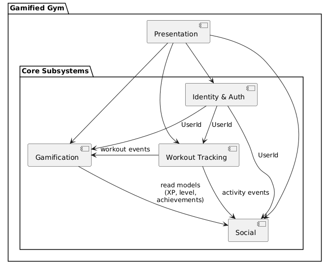

= Gamified Gym

== 1. Informative Part

=== 1.1 Team

**Managers:**
 Gian Gonzalez, 
 Kevin Lopez,
 Ricardo Perez

**Fitness Tracker Team:**
 Ernesto Soto (Team Leader),
 Cristian Massini,
 Pedro Matos,
 Cristian Barreras,
 Nelson Caban,
 Yandiel Hernandez,
 Luis Sorrentini,
 Michael Martinez

**Foundations Team:**
 Reinaldo Martinez (Team Leader),
 Estefania Roca,
 Lianette Alberto,
 Christian Rodriguez,
 Marcelo Perez,
 Christian Medina,
 Angel Ramos,
 Kevin Ibarra,
 Fernando Hidalgo

**Game Design Team:**
 Emmanuel Guadalupe (Team Leader),
 Aliana Santiago,
 Jorge Peralta,
 Keishlyany Sanabria,
 Diego Vazquez,
 Kiam Perez,
 Andrea Seda,
 Samael Alvarez

=== 1.2 Current Situation, Needs, and Ideas

==== 1.2.1 Current Situation
The current fitness-app landscape primarily offers simple workout loggers that behave like digital notebooks. These tools track sets and reps but provide little guidance, motivation, or meaningful feedback. As a result, many users—especially beginners—struggle to maintain consistency, losing interest because the app does not help them understand progress or stay engaged.

Additionally, without structured feedback, users often unknowingly overtrain some muscle groups while neglecting others. This creates imbalance, frustration, and potential injury risk. Existing apps rarely address this issue or provide insights beyond raw numbers.

Overall, the market lacks a motivating, engagement-driven tool that supports consistency, balanced development, and long-term adherence.

==== 1.2.2 Needs
From stakeholder observations and early discussions, people engaging in fitness training need:

Motivation systems that reward consistency and reduce the repetitiveness of daily training.

Clear and intuitive visualizations that reflect progress beyond basic statistics.

Awareness of how often each muscle group is trained to avoid imbalances and injuries.

A sense of community, accountability, and comparison that supports long-term commitment.

These needs arise directly from fitness-journey challenges, including early frustration, difficulty maintaining habits, and the lack of immediate feedback.

==== 1.2.3 Ideas
To address the identified needs, the following ideas emerged:

Introduce a gamified progress model with experience points, milestones, and achievement markers to reinforce consistency.

Provide a representation of muscle-group training balance so users can recognize strong and weak areas.

Offer intuitive progress summaries that highlight training frequency and volume across muscle groups.

Enable users to compare high-level training efforts with friends or peers to foster accountability and encouragement.

These ideas serve as early directions, not design decisions. They illustrate how the system-to-be could help users meet their fitness-related needs.

=== 1.3 Scope, Span, and Synopsis

==== 1.3.1 Scope and Span
This project lies within the domain of personal fitness training, motivation, and community-driven consistency. It aims to support users in understanding their own training behavior, maintaining balanced routines, and staying committed over time.

The scope includes identifying key stakeholders—beginners seeking direction, experienced gym-goers seeking balance, and socially motivated athletes—and studying their behavior to establish a domain representation. From these observations, requirements will be derived to ensure the system supports realistic training journeys.

The span of the project covers stakeholder analysis, domain modeling, requirements elicitation, and conceptual design. Any concrete technical decisions, implementation mechanisms, or UI structures fall outside the informative part and will be addressed later in the documentation.

==== 1.3.2 Synopsis
Gamified Gym is envisioned as an application that promotes long-term engagement in fitness training by combining workout tracking with motivational and community-oriented concepts. The project follows an iterative development process supported by stakeholder input, domain research, and structured modeling techniques.

Its focus is on understanding the athlete’s training behavior, progress patterns, and social drivers behind consistency. The final goal is to represent the domain in a way that supports motivating, balanced, and sustainable fitness progress.

=== 1.4 Other Activities Than Just Developing Source Code
Beyond coding, this project involves:

Domain Engineering: Understanding fitness behavior, training patterns, and motivational factors.

Requirements Engineering: Eliciting needs from stakeholders and translating them into clear system requirements.

Stakeholder Liaison: Communicating with fitness-interested individuals to validate domain findings and refine priorities.

Software Architecture: Structuring the conceptual design of the system-to-be.

Testing: Planning and conducting tests to ensure correctness, usability, and adherence to domain constraints.

Documentation & Analysis: Maintaining structured domain models, requirements, and conceptual descriptions throughout development.

=== 1.5 Derived Goals

Primary Goal:
Create an engaging, motivating fitness-support application that helps users stay consistent and maintain balanced training habits.

Secondary Goals:

Educational Value: Support users in understanding training principles such as balance, progression, and overuse awareness.

Community Building: Promote positive accountability and collective progress.

Domain Understanding: Capture the essential structures, behaviors, and motivational elements of real fitness journeys to inform later design.

==== 2.1 Domain Description

The domain focuses on how individuals plan, perform, and monitor their physical training activities. In the real world, users complete workouts composed of exercises, each characterized by attributes such as sets, repetitions, duration, or load. These actions generate measurable outcomes that contribute to long-term fitness progression. Users tend to revisit previous sessions, follow structured routines, and adjust training based on past performance.

Key domain concepts include workouts, exercises, user profiles, training schedules, and progress indicators. These domain objects and relationships exist independently of any software system and define the stable structure of the problem world. The domain also incorporates temporal aspects such as session timing, repetition frequency, and the evolution of performance over time.

The domain also includes the natural difficulties athletes face during training. Instability often emerges mid-set in the form of grip slips, bar path deviations, or uneven movement. Fatigue builds progressively, producing sensations such as burning, tightening, or loss of control, which may cause athletes to pause, reassess form, or stop a set early. Users frequently lose track of repetitions, forget loads, or change exercises when discomfort or confusion interrupts a session. These behaviors shape the real-world flow of training and influence long-term progress, consistency, and motivational patterns such as streaks or achievement milestones.

==== 2.1.1 Domain Rough Sketch (Raw Stories)
=== Raw Story: Losing Track During Supersets

Gym-Goer recounts:
"I started a superset of dumbbell curls at 25 pounds and tricep pushdowns at 40 pounds. I wanted to complete three sets of each, but halfway through the first set of curls, I realized I hadn’t kept track of the warm-up reps.

The first few reps felt fine, but by the fourth rep, my forearms burned, and I paused because I couldn't tell which set I was on. My grip felt shaky, and my breathing grew uneven.

On the next pushdown set, I tried to focus on the motion, but I kept losing focus and thinking about the earlier curls. I paused briefly, then started again. My arms tightened, and the movement became slower and less controlled.

I attempted another curl set, but my grip slipped slightly, and the movement became uneven. I lowered the dumbbells and stepped away, frustrated that I had lost track halfway through the session.

I moved on to a lighter machine row just to finish the workout, feeling mentally drained and unfocused."

=== Raw Story: Overreaching on Deadlift Day

Athlete recounts:
"I started my deadlift session at 185 pounds, I wanted to push a little harder than last week. My legs and back were already sore, but I felt determined to lift more.

The first two reps felt manageable, but by the third, I noticed my lower back tightening. My grip started slipping slightly on the bar, and my breathing became uneven.

On rep four, I paused to reset my stance. My shoulders felt stiff, and the bar path wasn’t straight. I paused for a moment before continuing, then I tried one more lift.

The next rep felt unstable, and I almost lost balance. I stopped immediately, feeling a sharp tension in my lower back. I stepped away from the bar, frustrated after feeling the sharp tightness in my lower back.

I decided to finish with lighter accessory exercises, feeling both sore and mentally exhausted."

=== Raw Story: Forgetting Previous Weights

Gym-Goer recounts:
"I started bench press at 95 pounds. I hadn’t tracked my previous workouts well, so I wasn’t sure if this was my last working set or the one before.

The first few reps felt heavier than expected. I paused mid-set, I couldn't remember the previous weight I used. My breathing grew shallow as my focus drifted away from the lift.

On rep five, my elbows flared slightly, and my chest felt unusually fatigued. I paused again to think about whether I should continue with the same weight or adjust.

I tried one more rep, but the bar path wobbled slightly, and I felt my strength fading. I stopped early and moved to dumbbell flyes at a lighter weight, feeling frustrated because the session felt disorganized."

=== Raw Story: Cardio With Side Stitches

Athlete recounts:
"I started on the treadmill at 5.5 mph. The first few minutes felt okay, but by minute three, I noticed a side stitch forming and my calves tightening. My breathing became shallow and irregular.

I tried to continue, but each step made the stitch worse, and my legs felt heavier with every stride. I slowed to a walk and held the rails for a few seconds, waiting to see if the stitch would ease.

I resumed jogging after a brief pause, but the pain returned almost immediately. My steps felt flat, and my feet struck the belt harder than usual.

I stopped early, feeling frustrated that I couldn’t maintain a steady pace. I walked slowly for a few minutes to recover, the tightness and heaviness where limiting my session."

=== Raw Story: Confused by Complex Routine

Gym-Goer recounts:
"I started with incline dumbbell press at 65 pounds. My routine alternates between different rep schemes each week, and I paused, unsure which rep scheme I was supposed to follow.

The first few reps felt awkward, and I paused between reps trying to remember the plan. My shoulders burned quicker than expected, and my grip felt unstable.

On rep five, my right arm shook slightly, I wasn't sure if I was doing the right number of reps. I paused again, trying to recall the proper sequence.

I tried one more rep, but the weight felt heavier than expected, and my arms trembled. I stopped early and moved to lateral raises, feeling mentally tired from the confusion."

==== 2.1.2 Terminology (Concepts Derived From Raw Stories)

=== Concept: Rep

Definition:
A single, complete motion of an exercise, such as lifting and lowering a weight.

Observed in raw stories:

“The first few reps felt fine…”

“On rep five, my elbows flared slightly…”

“The first two reps felt manageable…”

=== Concept: Set

Definition:
A group of consecutive reps performed without significant rest.

Observed in raw stories:

“I wanted to complete three sets of each…”

“I attempted another curl set…”

“I started my deadlift session… the first two reps…”

=== Concept: Grip

Definition:
The way the hands hold a weight or equipment during an exercise.

Observed in raw stories:

“My grip felt shaky…”

“My grip slipped slightly on the bar…”

“My grip started slipping.”

=== Concept: Bar Path

Definition:
The trajectory the barbell follows during a lift.

Observed in raw stories:

“The bar path wasn’t straight.”

“The bar path wobbled slightly…”

=== Concept: Tightness

Definition:
A physical sensation of tension in muscles during an exercise.

Observed in raw stories:

“My calves tightening…”

“I noticed my lower back tightening…”

“My arms tightened…”

=== Concept: Fatigue

Definition:
A decrease in muscle ability to continue producing force during an exercise.

Observed in raw stories:

“My chest felt unusually fatigued.”

“By the fourth rep, my forearms burned…”

“My legs felt heavier with every stride.”

=== Concept: Form

Definition:
The physical technique used to perform an exercise, including posture and movement quality.

Observed in raw stories:

“The movement became uneven…”

“My elbows flared slightly…”

“My right arm shook slightly…”

=== Concept: Pause

Definition:
A temporary stop in movement or exercise to regain control or reassess.

Observed in raw stories:

“I paused because I couldn’t tell which set I was on.”

“I paused to reset my stance.”

“I paused between reps…”

=== Concept: Side Stitch

Definition:
A sharp abdominal or rib-area pain that occurs during running or cardio.

Observed in raw stories:

“I noticed a side stitch forming…”

“but each step made the stitch worse...”

=== Concept: Balance

Definition:
The ability to maintain control and stability during a movement.

Observed in raw stories:

“I almost lost balance.”

“My steps felt flat…”

“the movement became uneven…”

=== Concept: Load

Definition:
The amount of resistance used in an exercise, typically measured in pounds.

Observed in raw stories:

“I started bench press at 95 pounds.”

“I started my deadlift session at 185 pounds.”

“I started incline dumbbell press at 65 pounds.”

=== Concept: Breathing Pattern

Definition:
The rhythm and control of breathing during exercise.

Observed in raw stories:

“My breathing became shallow and irregular.”

“My breathing grew uneven…”

“My breathing became uneven.”

=== Concept: Foot Strike

Definition:
How the foot lands during running or treadmill exercise.

Observed in raw stories:

“My steps felt flat…”

“My feet struck the belt harder than usual…”

“Each step made the stitch worse…”

=== Concept: Loss of Focus

Definition:
A moment during training when attention drifts away from the exercise, leading to interruptions, pauses, or inconsistent movement.

Observed in raw stories:

“I kept losing focus and thinking about the earlier curls.”

“I paused mid-set, I couldn’t remember the previous weight I used.”

“My focus drifted away from the lift.”

=== Concept: Decision to Stop Early

Definition:
A point during an exercise where the athlete ends the set or movement before completion due to physical cues such as tightness, instability, or increasing difficulty.

Observed in raw stories:

“I stopped early and moved to dumbbell flyes…”

“I stopped immediately when the tension in my lower back increased.”

=== Concept: Form Instability

Definition:
Irregular, uneven, or uncontrolled movement patterns during an exercise that indicate loss of technique quality.

Observed in raw stories:

“The movement became slower and less controlled.”

“The bar path wobbled slightly…”

“My right arm shook slightly…”

==== Domain Terminology in Relation to Domain Rough Sketch

The domain terminology was not taken directly from the raw stories. Instead, the raw stories in Section 2.1.1 were analyzed to extract recurring actions, sensations, and patterns observed during training sessions. These raw stories are unprocessed accounts, while the terminology in Section 2.1.2 represents refined concepts that emerged from examining those accounts.

For example, repeated mentions of “my grip slipped,” “my grip felt shaky,” and “my grip started slipping” were processed into the term Grip, with a precise definition that captures what the athlete is physically doing. Similarly, descriptions such as “the bar path wasn’t straight” and “the bar path wobbled slightly” led to the defined concept Bar Path.

Other terms — such as Tightness, Fatigue, Form, Loss of Focus, and Decision to Stop Early — were developed by grouping together multiple similar observations found across different raw stories. These definitions are not rough; they are the result of interpreting and refining what athletes repeatedly experienced.

Thus, Section 2.1.2 contains processed and clarified domain concepts, while Section 2.1.1 contains the unedited lived experiences that those concepts were derived from.

==== 2.1.4 Narrative
Athletes begin a set with a chosen weight and rep plan, often feeling stable at first. Early repetitions may feel 
manageable, but instability quickly emerges: grip slips, bar paths wobble, and motions become uneven. As the set 
progresses, muscles tighten suddenly in the forearms, back, chest, or shoulders, and breathing grows shallow or 
irregular, disrupting rhythm.

Mid‑set pauses are common, as athletes stop to reassess form, stance, or rep count. Confusion about previous 
loads or rep schemes interrupts the flow, leaving the athlete unsure whether to continue or adjust. Fatigue 
rises quickly, producing sensations of heaviness, burning, or trembling in specific muscles. Movements slow 
down, and instability or discomfort increases.

Athletes often attempt another rep after pausing, trying to regain control before stopping. But when strain 
escalates into sharp tightness, pain, or overwhelming fatigue, they frequently terminate sets early. They 
step away from the exercise, frustrated by the loss of control or disorganization. To finish the session, 
they switch to lighter weights, accessory machines, or slower pacing, seeking a manageable way to continue
 after instability or exhaustion.

This domain flow reflects how athletes operate under uncertainty, react to emerging sensations, and adjust 
mid-set. Training is rarely linear — it is shaped by interruptions, resets, and constant recalibration.

==== 2.1.5 Events / Behaviors / Functions

=== Pattern: Losing Control During Movement

Events & Behaviors (with raw-story quotes)

GripSlips

“my grip slipped slightly”

BarDoesNotMoveStraight

“the bar path wasn’t straight”
“the bar path wobbled slightly”

MovementSlowsUnexpectedly

“the movement became slower”

ArmShakesDuringLift

“my right arm shook slightly”

FootStrikeBecomesFlat

“my feet struck the belt harder than usual”

Domain Functions (based on actual athlete reactions)

steadyGrip() → ImprovedGrip
Justified by: multiple attempts to regain hold after grip becomes shaky.

slowDownMovement() → MovementState
Justified by: athlete reduces pace when movement becomes unstable.

resetMovementPath() → PathStatus
Justified by: athlete pauses and resets stance when bar drifts.

=== Pattern: Fatigue and Tightening

Events & Behaviors (with quotes)

ForearmsBurn

“my forearms burned”

LowerBackTightens

“my lower back tightening”

CalvesTighten

“my calves tightening”

BreathingBecomesShallow

“my breathing became shallow and irregular”

SideStitchAppears

“a side stitch forming”

Domain Functions (matching actions taken)

pauseBecauseOfTightness() → RecoveryState
Justified by:

“I slowed to a walk and held the rails…”

adjustEffortDueToFatigue() → EffortLevel
Justified by:

“the movement became slower and less controlled”

stopDueToTension() → StopOutcome
Justified by:

“I stopped immediately when the tension increased”

=== Pattern: Losing Track or Forgetting

Events & Behaviors (with quotes)

RepCountLost

“I couldn’t tell which set I was on”

WorkingWeightUncertain

“I wasn’t sure if this was my last working set”

RepPlanUnclear

“unsure which rep scheme I was supposed to follow”

AttentionShiftsAway

“my focus drifted away from the lift”

PauseToRecollect

“I paused again to think”

Domain Functions (as actually done by athlete)

pauseToRecollectPlan() → PlanStatus
Justified by:

“paused between reps trying to remember”

checkPreviousWeight() → WeightRecollection
Justified by:

“I paused mid-set, I couldn't remember the previous weight I used.”

restartSetAfterConfusion() → SetStatus
Justified by:

“I paused briefly, then started again”

=== Pattern: Stopping or Slowing Mid-Session

Events & Behaviors (with quotes)

AthleteSlowsDown

“I slowed to a walk”

AthletePausesSet

“I paused mid-set”

SetEndsBecauseOfInstability

“I stopped early”

DecisionToStopAfterPain

“I stopped immediately when the tension increased”

SwitchToLighterMovement

“I moved to dumbbell flyes at a lighter weight”

Domain Functions (matching next-step actions)

slowDownPace() → PaceLevel

stopSetEarly() → SetOutcome

switchToLighterMovement() → ExerciseChoice

=== Pattern: Changing Exercise Mid-Session

Events & Behaviors

SwitchToAccessoryExercise

“I decided to finish with lighter accessory exercises”

TransitionToMachine

“I moved on to a lighter machine row”

ChangeExerciseAfterConfusion

“I stopped early and moved to lateral raises”

ChangeExerciseAfterInstability

“I moved to dumbbell flyes”

Domain Functions

changeExercise() → Exercise

chooseEasierExercise() → Exercise

transitionToMachineWork() → Exercise

===2.1.6 Function Signatures

=== Pattern: Losing Control During Movement
steadyGrip(grip: Grip): Grip
slowDownMovement(movement: Movement): Movement
resetMovementPath(path: MovementPath): MovementPath

=== Pattern: Fatigue and Tightening
pauseBecauseOfTightness(tightness: Tightness): RecoveryState
adjustEffortDueToFatigue(fatigue: Fatigue): EffortLevel
stopDueToDiscomfort(discomfort: Tightness): StopOutcome

=== Pattern: Losing Track or Forgetting
pauseToRecollectPlan(plan: RepPlan): PlanStatus
checkPreviousWeight(load: Load): WeightRecollection
restartSetAfterConfusion(set: Set): SetStatus

=== Pattern: Stopping or Slowing Mid-Session
slowDownPace(pace: Pace): Pace
stopSetEarly(set: Set): SetOutcome
switchToLighterMovement(exercise: Exercise): Exercise

=== Pattern: Changing Exercise Mid-Session
changeExercise(current: Exercise): Exercise
chooseEasierExercise(exercise: Exercise): Exercise
transitionToMachineWork(exercise: Exercise): Exercise

==== 2.2 Requirements
We categorize all system requirements into four groups: **Domain**, **Functional**, **Interface**, and **Machine**. Each requirement is also assigned a priority level (**High**, **Medium**, or **Low**) to indicate its importance for the first release.

The primary requirements defined for this project include:
* **Workout Logging** – High
* **XP System** – High
* **Saved Workouts** – Medium
* **User Accounts** – High
* **Schedule / Planning** – Medium
* **Achievements** – Medium
* **Notifications** – Low

=== 2.2.1 User Stories, Epics, Features

This section summarizes the essential requirements for the first release of Gamified Gym.  
Requirements are grouped by type (Domain, Functional, Interface, Machine) and given a priority level  
(High, Medium, Low) according to business value, user needs, and architectural importance.

==== Core Requirements (High Priority)

• Workout Logging (Functional – High)  
  Users must be able to record exercises, sets, reps, and weight with low friction during a session.  
  Accurate logging is the foundation for progress tracking, achievements, and social comparison.

• Athlete Progress (Domain – High)  
  Training evidence (sets, reps, weight, session summaries) contributes to long-term domain concepts  
  such as XP, achievements, streaks, muscle balance, and plateaus.  
  These domain truths form the core of the gamification system.

• User Accounts / Identity (Functional / Constraint – High)  
  Each athlete has a unique identity used across all aggregates  
  (WorkoutSession, AthleteProgress, Leaderboard).  
  Authentication and data isolation are required for multi-user operation.

==== Supporting Requirements (Medium Priority)

• Saved Workouts Library (Functional – Medium)  
  Users can save, load, and modify previous sessions or routines  
  to accelerate planning and support consistent training behavior.

• Schedule / Planning (Functional – Medium)  
  Athletes can plan workouts across a calendar or weekly structure  
  to encourage consistency and long-term adherence.

• Achievements & XP Feedback (Functional – Medium)  
  The system provides feedback loops (XP increases, streak changes, achievement unlocks)  
  to support motivation, especially for beginners and competitive users.

• Muscle Balance & Plateau Insights (Domain – Medium)  
  The system interprets accumulated training evidence to surface meaningful domain facts:  
  muscle imbalance, stagnation trends, and progression anomalies.

==== Optional / Enhancing Requirements (Low Priority)

• Social Motivation (Functional – Low)  
  Comparison sets, relative rankings, and friend-based accountability  
  support users who train socially or competitively, but are not required for the core workflow.

• Notifications (Interface – Low)  
  Reminders, streak alerts, and achievement prompts improve retention  
  but do not affect the domain model.

==== Quality & Performance (Non-Functional)

• Usability (Medium)  
  Logging a typical 3-set exercise should be achievable within a reasonable time window  
  (target usability metric ≈ 30 seconds end-to-end).

• Performance (Medium)  
  Data retrieval and saving operations should complete within target durations  
  to support frictionless training sessions.

==== Traceability Notes

• Personas Beginning/Anxious users → high-priority for simplicity, clarity, feedback.  
• Competitive users → priorities for XP, achievements, social comparison.  
• Experienced/consistent users → priorities for muscle balance, plateau detection, planning.

==== 2.2.2 Personas
* Alex, the Beginner
 ** Background:
Alex is a 28-year-old office worker with long hours at a marketing firm in Miami, Florida. He 
experiences daily fatigue from sitting at a desk and has minimal experience with structured fitness 
training. He trains irregularly, attempting workouts after work when energy levels are low.

 ** Fitness Behavior:
Alex is new to the gym and trains inconsistently, often skipping workouts after a few weeks. He does not
follow a structured program and is unsure which exercises target which muscle groups. He attempts to track
workouts informally but lacks understanding of whether his training is balanced. He struggles to identify
whether he is making progress and does not know how to adjust weight, sets, or reps appropriately. Alex 
feels uncertain about proper form and intensity, leading to cautious, conservative training that may 
limit progress.

 ** Motivations & Goals:
Alex wants to build a consistent workout habit to improve energy levels and overall health. He seeks to 
feel more confident in his physical capabilities and reduce sluggishness from sedentary work. Small, 
visible wins motivate him to continue, as he wants proof that his effort is producing results. He is 
motivated by clear guidance that removes uncertainty about what to do next.

 ** Pain Points:
Alex feels overwhelmed by fitness terminology and unsure where to start. He fears developing muscle 
imbalances or injuring himself by doing exercises incorrectly or overdoing certain movements. He struggles
to maintain motivation when he cannot see or measure his progress. Current tracking methods feel tedious 
and provide no meaningful feedback. Alex feels anxious when other people can see his activity or 
progress, particularly early in his fitness journey when results are minimal. He experiences difficulty 
fitting workouts into busy, irregular schedules.

 ** How This Persona Interacts With the Domain:
Alex represents beginners who need clarity on training fundamentals: which muscle groups are being 
trained, whether volume is balanced, and whether progress is occurring. He requires visibility into basic
metrics like training volume and frequency to build confidence. His anxiety about imbalances and injury 
reflects the domain principle that balanced training across muscle groups is essential for long-term 
development.

* Diego, the Competitive Gamer
 ** Background:
Diego is a 22-year-old computer science student from San Juan, Puerto Rico. He has irregular training 
availability due to coursework and gaming schedules, and he trains in the afternoons or evenings when time
permits. He is a relative beginner with limited gym experience but is familiar with progression systems 
from gaming.

 ** Fitness Behavior:
Diego trains inconsistently, often stopping after a few weeks when motivation fades. He performs 
exercises without tracking detailed metrics and lacks structure in his routine. He does not have a clear 
understanding of how to progress in strength or volume over time. Diego is drawn to visible indicators of 
improvement but current methods do not provide this feedback. He trains alone and struggles with 
accountability, often skipping sessions when external motivation is absent. He is motivated by comparisons
with friends and wants to demonstrate physical improvements in social settings.

 ** Motivations & Goals:
Diego wants to improve his physical strength to feel more capable in physical challenges with friends. He 
is motivated by measurable progress that feels similar to leveling up or earning achievements in games. He
seeks consistency by transforming workouts into rewarding, quantifiable experiences. Diego values 
competition and wants to compare his progress with peers to stay motivated.

 ** Pain Points:
Diego finds gym training repetitive and unrewarding, lacking the sense of achievement he experiences in 
gaming. He struggles with accountability when training alone and needs external motivation to maintain 
consistency. Current tracking methods feel lifeless and provide no feedback on whether effort is 
translating into progress. He does not know whether his training is balanced or effective. Diego feels 
physically weaker than his friends and wants proof of improvement to build confidence in social 
situations.

 ** How This Persona Interacts With the Domain:
Diego represents users who require visible, quantifiable progress metrics to sustain motivation. He needs 
clear indicators of strength improvement, training volume accumulation, and consistency over time. His 
competitive nature aligns with the domain principle that social comparison and shared effort can 
reinforce fitness journeys. His struggles with accountability highlight the importance of tracking 
consistency metrics like streaks and completion rates. 

* Sarah, the Consistent Trainer
 ** Background:
Sarah is a 32-year-old high school teacher from Austin, Texas, who has maintained a regular gym routine 
for two years. She trains early in the morning before school and follows a structured schedule. She is 
knowledgeable about basic exercises and nutrition and is experienced with fundamental training principles.

 ** Fitness Behavior:
Sarah trains consistently four to five times per week, following a self-designed routine. She tracks 
sets, reps, and weights informally in a notes app but has limited visibility into trends or patterns. 
She has recently experienced a performance plateau where strength and endurance are no longer improving 
despite continued effort. Sarah suspects she may be neglecting certain muscle groups but lacks data to
confirm this. She understands basic progression principles but is uncertain how to adjust her training to 
overcome the plateau. She values discipline and data-driven insights but finds her current tracking 
method fragmented and non-actionable.

 ** Motivations & Goals:
Sarah wants to optimize her training to overcome her current plateau and ensure balanced development 
across all muscle groups. She is motivated by measurable results and continuous improvement. She seeks to 
deepen her understanding of training principles and apply data-driven insights to her routine. Sarah 
wants to add a new layer of challenge and engagement to her well-established fitness routine beyond 
simply increasing weight.

 ** Pain Points:
Sarah has hit a performance plateau and suspects unbalanced training is contributing to stagnation. Her 
current tracking method provides no actionable insights into volume distribution, progress trends, or 
muscle group balance. She finds most fitness apps too simplistic and not designed for experienced, 
disciplined users. Sarah feels frustrated that her routine has become repetitive and lacks fresh 
challenges. She needs detailed, data-driven analytics to identify weaknesses and adjust her training 
effectively.

 ** How This Persona Interacts With the Domain:
Sarah represents experienced users who understand training fundamentals but require deeper insights into 
performance trends and muscle balance. Her plateau reflects the domain principle that athletes experience 
periods where progress stagnates despite continued effort. She needs visibility into training volume 
distribution across muscle groups and historical trends to identify imbalances and adjust training 
strategies. Her need for data-driven insights highlights the importance of tracking and visualizing 
progress over time.

* Marcos, the Social Trainer
 ** Background:
Marcos is a 24-year-old graduate student from Chicago, Illinois, who treats fitness as a social activity.
He trains with a close-knit group of friends three to four times per week, typically in the evenings. He 
is moderately experienced with basic exercises and follows a loosely structured routine.

 ** Fitness Behavior:
Marcos trains consistently when his workout group is available but struggles to maintain motivation when 
training alone. His training depends heavily on social accountability and the presence of his friends. He 
tracks workouts informally and shares milestones with his group. He thrives on friendly competition and 
mutual encouragement, using social pressure to maintain consistency. Marcos values consistency streaks 
and collective progress more than raw strength gains. He occasionally mentors less experienced friends in
the gym, providing guidance and encouragement.

 ** Motivations & Goals:
Marcos is primarily motivated by community, accountability, and shared achievement. He wants to maintain 
strong connections with his workout group by tracking progress together and celebrating milestones. He 
thrives in positive, friendly competitive environments that emphasize consistency and effort. Beyond 
personal improvement, Marcos wants to inspire and motivate others to adopt healthier habits and build 
supportive fitness communities.

 ** Pain Points:
Marcos struggles to stay motivated when his workout group is unavailable, leading to inconsistent training
during busy weeks or when schedules do not align. He finds it difficult to track shared progress and 
celebrate group milestones without manual coordination. Current methods for comparing consistency and 
effort among friends are fragmented and require external platforms. Marcos feels isolated when training 
alone and lacks the accountability that his social group provides. He wants a way to foster a small, 
supportive community centered around collective growth and mutual encouragement.

 ** How This Persona Interacts With the Domain:
Marcos represents users for whom social dynamics are central to training consistency. His reliance on 
group accountability reflects the domain principle that community support and shared accountability 
contribute to long-term consistency. His focus on collective progress and consistency streaks highlights 
the importance of tracking shared metrics like workout frequency and completion rates. His struggles when 
training alone underscore the motivational role of social comparison and mutual support in maintaining 
fitness engagement.

==== 2.2.3 Domain Requirements
* Training Fundamentals
 ** Training volume is calculated as weight × sets × repetitions. Exercises target one or more muscle 
groups (e.g., Chest, Back, Legs, Shoulders, Arms, Core). A personal record (PR) represents the highest 
weight successfully lifted for a given exercise. Muscle groups must be trained with balanced volume to 
avoid long-term imbalances and reduce injury risk.

* Progress and Performance
 ** Strength and endurance improvements occur over extended periods of consistent training. Athletes 
experience periods where strength or endurance does not increase despite continued training (performance 
plateaus). Athletes stay motivated when progress is visible and measurable over time. Varying repetition 
ranges can help overcome performance plateaus.

* Training Behavior
 ** Athletes track exercises by recording the exercise name, weight, sets, and repetitions. Long-term 
consistency in training requires sustained motivation beyond initial enthusiasm. Training distribution 
across muscle groups affects overall physique development and injury prevention.

* Social Dynamics
 ** Athletes are motivated by comparing their progress with peers who share similar fitness goals. 
Achieving significant milestones provides opportunities for recognition and social reinforcement. 
Community support and shared accountability contribute to training consistency.

 
==== 2.2.4 Interface Requirements
* Workout Logging Interface
 ** The system shall provide an interface for users to log an exercise by specifying the exercise name,
weight lifted, number of sets, and number of repetitions per set. The system shall require that every 
logged exercise be associated with at least one primary muscle group. The interface shall enable a user to
input and submit a standard 3-set exercise in under 30 seconds.

* Progress Tracking
 ** The system shall calculate and display a historical graph of total training volume for each muscle 
group over a user-selectable time period. The system shall track and highlight new Personal Records (PRs) 
when a user logs a set with higher weight than any previous set for that exercise. All charts and graphs 
depicting muscle balance shall be understandable at a glance without requiring manual interpretation of 
data tables.

* Training Guidance
 ** The system shall suggest alternative exercises during the logging process if the user's current 
selection disproportionately targets an already dominant muscle group based on muscle balance metrics. 
When the system detects a performance plateau, it shall provide automated suggestions for changes in 
repetition ranges. The system shall allow users to input goals based on specific timeframes and 
automatically generate a structured, periodized workout plan toward that goal.

* Gamification Interface
 ** The system shall assign users a rank (Bronze, Silver, Gold, etc.) for each muscle group, calculated 
based on total historical training volume and PRs for that muscle group. The system shall award users
experience points (XP) for completing workouts and achieving milestones.

==== 2.2.5 Machine Requirements
* Data Integrity
 ** The system shall maintain an average response time of no more than 2 seconds for user interactions, 
such as updating activity data under normal operating conditions. In the event of a search query, the 
system shall return data retrieval operations within 4 seconds, even during peak usage.

* System Stability
 ** The system shall run under normal conditions, when  concurrently running 300 user interactions that all
randomly start within a 5 minute interval. Beyond this threshold, the system shall gracefully degrade its 
performance, prioritizing essential functionalities such as the viewing workout history and submitting of 
exercise logs.

* System Efficiency
 ** The system shall gracefully handle an increase when concurrently running 100 user interactions at any 
given time by dynamically allocating resources. Beyond this threshold, new user connections shall be 
queued, and the system shall restrict additional connections until resources become available. The system
shall process and store a standard 3-set exercise log within 2 seconds of submission.

==== 2.3 Architecture Overview

The conceptual architecture is organized into four subsystems, each aligned with a specific group of aggregates and domain responsibilities.
Each subsystem protects its own invariants and emits domain events that other subsystems may consume.

Subsystem boundaries are defined by:

* which **aggregates** and **domain concepts** they own,
* which **invariants** they protect,
* and which **information they expose** to other subsystems.

The main conceptual subsystems are:

* Training & Sessions
* Progress & Gamification
* Social Motivation
* Athlete Registry

==== 2.3.1 Core Subsystems and Responsibilities

The conceptual architecture is organized into four subsystems, each aligned with a specific group of aggregates and domain responsibilities.
Each subsystem protects its own invariants and emits domain events that other subsystems may consume.
Subsystem boundaries are defined not only by ownership of aggregates, but also by the invariants each subsystem enforces and by what is not allowed to cross the boundary.

*Training & Sessions Subsystem*

*Owned aggregates (examples):*
- `WorkoutSession` (root), containing `ExerciseEntry`, `SetEntry`, rest periods, and session-level metadata.
- Conceptual structures used to represent planned sessions or routines, where applicable.

*Responsibility:*
- Define and manage the structure of workouts and training sessions.
- Plan and organize training sessions toward given goals (structuring a session or routine based on a training goal).
- Manage the lifecycle of a workout session:
  - Beginning a session.
  - Choosing exercises.
  - Recording sets, rest, and completion.

*Key invariants enforced:*
- A workout session has a valid chronological sequence of actions (no negative time, no “end” before “begin”).
- Every recorded set belongs to a chosen exercise within that session.
- Reps, weight, and intensity values obey domain constraints (non-negative quantities, valid intensity ranges).

*Domain events emitted:*
- *Exercise Completion Event*: triggered when an athlete completes a set or repetition.
- *Workout Completion Event*: triggered when all planned exercises in a workout session are finished.
- *Personal Best Event*: emitted when session performance surpasses previous records.

*Exposed information:*
- Structured training evidence (sets, exercises, volumes, muscle-group involvement).
- Session-level summaries and events describing what actually happened during training.

*Boundary constraints (what cannot cross this boundary):*
- External subsystems cannot directly mutate `WorkoutSession` or its internal entities.
- Training-specific structures (raw `ExerciseEntry` and `SetEntry`) are not exposed for modification outside the subsystem; external consumers only see read-only evidence or summaries.
- Progress or social metrics (XP, ranks, relative standings) must not be defined inside Training & Sessions.

*Progress & Gamification Subsystem*

*Owned aggregates (examples):*
- `AthleteProgress` (root), including:
  - XP totals.
  - Level.
  - Streak state.
  - Collections of `Achievement` or `Milestone`.

*Responsibility:*
- Interpret training evidence produced by Training & Sessions and maintain long-term progress representations.
- Apply progression rules and enforce invariants, such as:
  - XP accumulation and scaling rules.
  - Achievement unlock conditions.
  - Streak continuity and reset conditions.
- Analyze historical training data to detect domain-relevant patterns:
  - Shifts in muscle balance.
  - Performance plateaus.
  - Consistency trends.
- Produce domain-level progress facts needed by other subsystems.

*Key invariants enforced:*
- XP totals cannot decrease arbitrarily; changes follow defined progression rules.
- Achievements and milestones cannot be unlocked unless their domain criteria are satisfied.
- Streaks are calculated according to consistent time windows and cannot be “patched” manually.
- Muscle balance and plateau detection follow stable, documented rules.

*Domain events emitted:*
- *Achievement Unlocked Event*: emitted when accumulated progress meets the criteria for a milestone.
- *Overtraining Warning Event*: emitted when long-term patterns indicate unhealthy imbalance or excessive fatigue.
- *Personal Best Event*: may also be re-emitted or interpreted to update long-term progress (if applicable to the domain logic).

*Exposed information:*
- Abstract progress metrics (XP, level, streak length, achievement states).
- Muscle balance indicators and other derived insights as domain facts.

*Boundary constraints (what cannot cross this boundary):*
- Raw training structures (`WorkoutSession`, `ExerciseEntry`, `SetEntry`) are not stored or mutated here; they are only interpreted as evidence.
- UI-specific notions (screens, feeds, visualizations) are not modeled in this subsystem.
- Social comparison structures (leaderboards, relative positions) are not owned here; they belong to Social Motivation.

*Dependencies:*
- Consumes training evidence and events from the Training & Sessions subsystem.
- Does not plan or structure workouts (those responsibilities remain in Training & Sessions).

*Social Motivation Subsystem*

*Owned aggregates (examples):*
- `Leaderboard` (conceptual aggregate representing comparative performance data).
- Social comparison structures such as `AthleteComparisonSet` or other domain constructs capturing which athletes are being compared and by what criteria.

*Responsibility:*
- Maintain domain-level structures that support social comparison and accountability.
- Track comparison-relevant groupings and relations among athletes (sets of athletes being compared under a specific rule).
- Produce rank-relevant domain facts, such as:
  - Relative positions within a comparison set according to defined metrics.
  - Changes in relative ordering when progress or consistency changes.
- Enforce comparison invariants:
  - Comparison metrics must be based on well-defined progress data.
  - Ties and ranking rules are consistently applied.

*Key invariants enforced:*
- Each leaderboard or comparison structure is built on a clearly defined metric (XP, streak length) and time window.
- Relative ordering is consistent with that metric (no contradictions such as two different athletes occupying the same rank without a tie rule).
- Only athletes belonging to a given comparison set are included in its ranking.

*Domain events emitted:*
- *Achievement Unlocked Event*: reused contextually when an unlocked achievement is relevant to comparison structures.
- *Personal Best Event*: reused when relevant for group-level performance comparison.

*(Note: the Social subsystem does not introduce new domain events; it reinterprets existing ones in a comparative context.)*

*Exposed information:*
- Abstract comparative metrics, such as:
  - Athlete ordering within a defined comparison set.
  - Rank positions and changes in rank.
  - Comparison-relevant state (“this athlete is above/below another according to metric X”).

*Boundary constraints (what cannot cross this boundary):*
- Social Motivation does not store or mutate `AthleteProgress` or `WorkoutSession` aggregates.
- UI concepts such as posts, feeds, or visual layouts are not modeled here.
- Identity details beyond the `AthleteId` and comparison-relevant facts are not managed here; those remain in Athlete Registry and other subsystems.

*Dependencies:*
- Consumes progress-related facts (XP, levels, achievements, streaks, muscle balance indicators) from Progress & Gamification.
- May consume high-level training summaries from Training & Sessions when relevant for comparison logic.

*Athlete Registry Subsystem*

*Owned aggregates (examples):*
- `Athlete` as the root entity representing a person who trains, with stable identity and profile attributes.

*Responsibility:*
- Act as the canonical source of athlete identity in the domain.
- Maintain invariants such as:
  - Every athlete has a unique `AthleteId`.
  - Profile and configuration attributes respect domain constraints.
- Provide identity and static attributes used by other subsystems to associate training, progress, and social structures to specific athletes.

*Key invariants enforced:*
- No duplicate identities (unique `AthleteId` per athlete).
- Identity is stable over time; other subsystems cannot reassign events from one athlete to another arbitrarily.
- Only valid, domain-accepted attribute values are stored in the athlete profile.

*Domain events emitted:*
- *(None of the five defined events originate from Athlete Registry.)*

*(Registry may reference events but does not emit them, consistent with its identity-only role.)*

*Exposed information:*
- `AthleteId` and stable profile attributes required for other subsystems to bind their aggregates and events to the correct athlete.

*Boundary constraints (what cannot cross this boundary):*
- Other subsystems cannot change `Athlete` identity or profile data directly; they can only reference athletes via `AthleteId`.
- Training, progress, or social-specific state is not stored in Athlete Registry.

*Dependencies:*
- Conceptually independent of Training & Sessions, Progress & Gamification, and Social Motivation.
- Serves as a foundational subsystem referenced by all others.

==== 2.3.2 Boundaries and Information Flows

Subsystem interactions follow strict, directional boundaries.
The goal is to prevent cyclic dependencies while allowing higher-level abstractions to build on lower-level evidence.
In addition to directional dependencies, each boundary defines what must not cross it and where translation/anti-corruption occurs.

1. *Ownership, Invariants, and Isolation*

Each subsystem owns its aggregates and enforces its invariants:

- Only *Training & Sessions* may alter `WorkoutSession` and training structures.
- Only *Progress & Gamification* may alter `AthleteProgress` and its embedded progress state.
- Only *Social Motivation* may alter `Leaderboard` and other social comparison aggregates.
- Only *Athlete Registry* may alter `Athlete`.

Other subsystems may read high-level domain facts or summaries, but they cannot directly mutate aggregates owned by another subsystem.
This enforces a clear *anti-corruption boundary*: no subsystem is allowed to “reach inside” another subsystem’s aggregates and bypass its invariants.

2. *Flow of Information: From Concrete Evidence → Derived Insights → Social Comparison*

*Training & Sessions → Progress & Gamification*

- Training & Sessions produces concrete training evidence in the form of:
  - Completed sets and exercises.
  - Session summaries (training volume, muscle group participation).
  - Events such as `AthleteCompletesSet`, `AthleteEndsWorkoutSession`, `PersonalRecordAchieved`.
- Progress & Gamification consumes this evidence to:
  - Adjust XP and level.
  - Update streaks.
  - Unlock achievements.
  - Detect shifts in muscle balance or plateaus.

*Anti-corruption / translation at this boundary:*
- Raw training structures (`WorkoutSession`, `ExerciseEntry`, `SetEntry`) are translated into neutral *evidence objects* or event payloads before entering Progress & Gamification.
- Progress & Gamification does not manipulate `WorkoutSession` directly; it operates on a translated representation that is stable for its own invariants.

*Progress & Gamification → Social Motivation*

- Progress & Gamification produces progress facts such as:
  - Current XP and level.
  - Achievement and milestone states.
  - Streak lengths.
  - Balance or plateau indicators.

- Social Motivation consumes these progress facts to:
  - Construct and maintain comparison sets and rankings.
  - Determine when relative positions change and emit events like `RelativeRankChanged`.

*Anti-corruption / translation at this boundary:*
- `AthleteProgress` is not exposed as a mutable aggregate to Social Motivation.
- Instead, Social Motivation receives derived metrics (XP values, streak lengths, achievement counts, etc.) in a form adapted to its comparison rules.
- Social Motivation’s comparison structures (`Leaderboard`) are built from these metrics, not from direct references to `AthleteProgress`.

*Training & Sessions → Social Motivation*

- When necessary for comparison, Social Motivation may also consume high-level training summaries such as:
  - Number of recent sessions in a time window.
  - Presence of recent personal records.

*Anti-corruption / translation at this boundary:*
- Social Motivation does not work with raw training aggregates; it uses translated summaries or events that encode only the information needed for comparison.

3. *Role and Boundaries of Athlete Registry*

- Every subsystem uses `AthleteId` from Athlete Registry to associate its aggregates and events with a specific athlete.
- Athlete Registry does not depend on other subsystems; it is a foundational reference point rather than a consumer of training, progress, or social state.

*Anti-corruption aspects:*
- No subsystem may invent or reinterpret athlete identity; they must use the `AthleteId` and attributes exposed by Athlete Registry.
- Mapping from external identifiers (user accounts in the outer world) to `AthleteId` happens through translation layers outside the domain subsystems; inside the domain, `AthleteId` is the stable reference.

*Conceptual Summary*

Overall, the subsystems form a conceptual pipeline:

- *Training & Sessions* provides *concrete evidence* about what the athlete actually did.
- *Progress & Gamification* converts that evidence into *interpreted, long-term insights* about the athlete’s journey.
- *Social Motivation* uses those insights (and, when needed, high-level training summaries) to derive *social comparison structures* that describe how athletes relate to each other.
- *Athlete Registry* underpins all of this with stable identity, ensuring that every event, aggregate, and comparison is consistently tied to the correct athlete.

Subsystem boundaries are enforced through:

- Strict ownership of aggregates and invariants.
- Directional dependencies.
- Translation and anti-corruption layers between subsystems so that no aggregate is modified outside its owning subsystem and no boundary is crossed with raw, uncontrolled structures.

==== 2.3.3 Conceptual Architecture Diagram

The diagram below illustrates the conceptual boundaries and dependency directions between subsystems. Arrows indicate which subsystem **depends on** another and what kind of information it consumes.

== 3. Analytic Part

=== 3.1 Concept Analysis

* Statements:
** *Statement A (The Fading Novice):* "I started going to the gym after Christmas last year and really got into it. I went on 4 days every week and did yoga on the other days, but after about 6 weeks—when the semester picked up pace and exams were coming up—I lost drive and went less often. Then I noticed I was lifting less than the week before, and that discouraged me even more."
** *Statement B (The Intimidated Beginner):* "I feel intimidated and out of place in the gym. I'm not sure if I'm doing the exercises correctly or whether I'm making progress at all. It’s hard to stay motivated when it feels like a chore and you can’t see immediate results."
** *Statement C (The Plateaud Regular):* "I’ve been training consistently for two years, but I’ve hit a wall. My numbers aren’t improving, and my routine feels repetitive. I suspect I’m neglecting certain muscle groups, but I don’t have the insight or data to confirm it."

* Observed abstractions:
** All statements highlight the challenge of maintaining long-term engagement in fitness activities.
** Motivation appears closely tied to visible progress and feedback.
** Training consistency emerges as a critical factor for both progress and sustained participation. 
** Knowledge gaps, lack of guidance, and insufficient feedback contribute to uncertainty and reduced commitment.

* Key Domain Concepts: 
** *Activity Engagement:* The degree to which users participate in structured fitness activities over time, measured by frequency, duration, and intensity.
** *Motivation Factor:* Internal and external triggers that influence a user's willingness to initiate and maintain fitness activities.
** *Training Balance:* The equitable distribution of training focus across major muscle groups to prevent imbalances and optimize development.
** *Training Consistency:* Quantitative measures of regular participation and training.
** *Performance Plateau:* A stagnation in measurable or perceived progress that often leads to reduced motivation and disengagement.

* Potential Ambiguities:
The domain reveals several concepts that require clarification before modeling. For example, *progress* may refer to
strength increase, visible physique changes, endurance, or consistency streaks, depending on the user's perspective.
*Motivation* may arise from internal factors (confidence, mastery) or external factors (achievements, comparison), affecting
how it should be represented in the model. *Training balance* can mean balanced weekly volume, balanced intensity, or long-term
development, suggesting multiple interpretations. *Plateau* may indicate physiological stagnation, lack of training variation, or
psychological fatigue. *Consistency* may refer to frequency of sessions, adherence to a plan, or sustained progression, and must be 
clarified to define its domain meaning. These ambiguities must be resolved when refining the domain model to ensure consistent
terminology and logic.

=== 3.2 Validation and Verification

*Validation*

Validation is the process of ensuring that the {pname} application meets the needs and expectations of its target users. 

The validation process for GamifiedGym will be conducted through structured scenario walkthroughs, terminology checks, and targeted stakeholder sessions. 
For example, one scenario we generated was: “Alex has logged all workouts for two weeks. After recording a new bench-press PR, the system highlights the updated PersonalRecordAchieved event and updates his Chest muscle-group training volume. He checks his MuscleGroupBalance indicator and notices his Back volume is significantly lower. The system highlights this imbalance as a domain fact, allowing him to make informed 
adjustments to his routine.”
When this scenario was evaluated with prospective users, they indicated that achievement systems and partner-based accountability felt motivating, but emphasized that achievements must be both frequent and progressive (short-term and long-term milestones).

*Domain-Focused Validation Approach*

Validation activities check whether users correctly interpret core domain concepts such as TrainingBalance, PersonalRecordAchieved, consistency streaks, XP progression, and plateau detection. 
Scenario walkthroughs test whether the domain behaviors match user expectations—for example, whether users understand why the system flags a muscle-group imbalance or identifies a plateau in performance.

Low-fidelity prototypes are used only to verify that domain feedback (e.g., PR recognition, muscle-volume distribution, or streak continuity) is understandable. 
These prototypes validate conceptual clarity—not detailed UI layout or interaction mechanics. Prototype validation focuses exclusively on whether domain information is interpretable, not
on UI appearance or design details.

*Additional Validation Activities:*

* *Terminology checks:* Ensuring consistency of terms such as goal, achievement, and quest across requirements and scenarios.
* *Scenario-based requirement testing:* Using multiple contrasting scenarios (success cases, failure cases, edge cases) to reveal hidden assumptions in the requirements.
* *Stakeholder workshops:* Presenting narratives of motivational barriers and gamified reinforcement strategies to verify alignment with real experiences.
* *Early prototypes:* Low-fidelity UI mockups will be used to validate whether users clearly understand progression and rewards.
* *Cognitive walkthroughs:* Evaluating whether first-time users can understand feedback loops, training balance indicators, and progression paths without instruction.
 
Validation activities will be carried out collaboratively by all project stakeholders throughout development. These stakeholders include:

* *Project Supervisor (Professor):* Provides guidance and feedback on whether validation outcomes align with project goals.
* *Development Team:* Iterates on requirement definitions, scenario construction, and prototype evaluation based on validation results.
* *End Users (Students/Gym-goers):* Share firsthand feedback on scenarios, prototypes, and usability, serving as the most critical source of validation for motivational effectiveness.
* *Domain Consultants (e.g., gym staff or experienced trainers):* Provide insight into feasible training progressions, realistic motivational barriers, and safety considerations.

*Verification*

Verification is the process of ensuring that GamifiedGym is being built correctly and that it fulfills the specified requirements. It confirms that the apps features and deliverables work as intended.

*Purpose and Importance:*

Verification will ensure that deliverables meet their stated requirements and perform as intended. Planned verification methods include:

* *Unit testing:* Testing core functions such as progression tracking, badge assignment, goal creation, and partner-matching logic in isolation.
* *Integration testing:* Verifying end-to-end flows.
* *Completeness checks:* Ensuring that all concepts identified in Section 3.1—such as TrainingBalance and MotivationFactor—are fully represented in requirements, scenarios, and implementation.
* *Acceptance testing:* Confirming that final functionality matches validated scenarios and stakeholder expectations.
* *Traceability reviews:* Mapping requirements to tests, scenarios, and implemented features to ensure no domain concept has been omitted.
