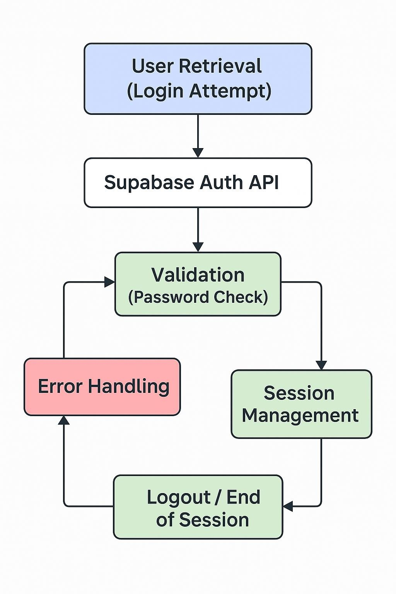

*User Object Life Cycle for LogIn (with Supabase)*

== Introduction 

In software design, understanding the life cycle of domain objects is
crucial when implementing critical functionality like login. In Gamified
Gym, the Foundations Team is responsible for the functional behavior of
the login page, which uses email/password authentication, and Supabase
as the backend service.

The User object governs login state and validation, while the UI
elements—email and password fields, Log In button, and forgot
password/sign-up URLs—interact directly with this object’s lifecycle. By
linking theory to practice, the Foundations Team ensures secure,
responsive, and consistent login functionality.

== Identifying the Domain Object 

The User object consists of:

* Email (identifier)
* Password (hashed and managed by Supabase)
* Session (token issued on successful login)

Supabase handles authentication and session storage. The Foundations
Team’s task is to implement functional hooks: the Log In button triggers
login attempts, errors are displayed inline, and redirects occur for
password recovery or sign-up.

== Life Cycle Analysis 

[arabic]
. Retrieval (Login Attempt):
* Triggered by pressing the Log In button.
* Supabase Auth API fetches the User object using email.
. Validation (Password Check):
* Supabase verifies the password.
* Success → session token issued; Failure → error returned.
. Error Handling:
* Invalid credentials → display “Incorrect email or password.” o
Optional: track failed attempts and suggest password recovery or account
creation.
. Session Management:
* On success, JWT token stored locally.
* Session validity drives user access to protected screens.
. Logout / End of Session:
* Token cleared in UI; Supabase optionally invalidates session
server-side.

_Figure 1.1 User Object Life Cycle for LogIn_

== Mapping Functionality to UI 

* Log In Button: Calls Supabase API, triggers lifecycle stages.
* Error Messages: Update UI in response to failed validation.
* Forgot Password / Sign-Up URLs: Redirect users to appropriate
workflows.

Reactive behavior ensures consistency between User object state and
functional responses.

== Applying Design Principles 

* Modularity: Functional hooks (login, error handling, redirect)
implemented as independent functions.
* Abstraction: UI interacts with login service layer instead of raw API
calls.
* Effective Modeling: User object aligns with Supabase Auth schema;
reduces integration errors.

== Communication with Backend / Supabase 

[arabic]
. Which API endpoints handle authentication, failed attempts, and
session refresh?
. What error codes correspond to invalid credentials or network
failures?
. How is session expiration handled, and what UI behavior should follow?

== Risks and Mitigation 

* Invalid sessions: Ensure token storage is secure and cleared on
logout.
* Repeated failed attempts: Optionally limit attempts or suggest
recovery.
* Network/API failures: Handle errors gracefully with UI feedback.

== Tools and Patterns 

* Repository / Service Layer: Handles login API calls and session
management.
* Observer Pattern: Updates functional UI elements based on login state
changes.
* MVC: Separates functional logic (controller/service), User object
(model), and UI elements (view).

== Conclusion 

Focusing on the functional layer of the login page, the Foundations Team
applies life cycle principles to ensure secure, consistent, and
responsive authentication. Supabase handles backend verification and
session management, while the team ensures correct integration, error
handling, and workflow navigation. This demonstrates the direct
application of theoretical object life cycle concepts to practical
native app development.
