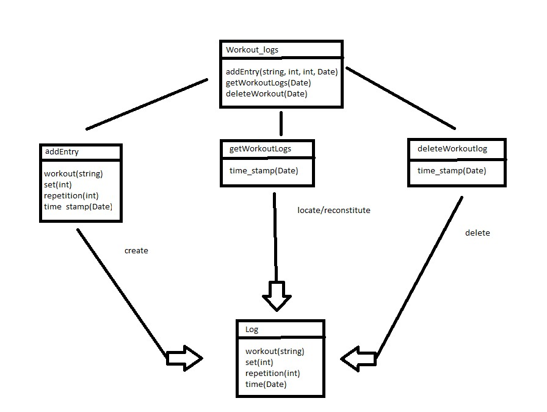

The goal of these diagrams is to gain as much usability while
maintaining lower complexity especially in the query selects. In the
diagram we can se the main three states of log its creation,
locate/reconstitute, and deletion. To maintain simplicity in the select
query the Date object will not contain information about hour, minutes,
or seconds. getWorkoutlogs uses time_stamp for a select to
locate/reonstitute the logs that have the same time_stamps effectively
returning all the logs of the day the time_stamp. deleteWorkoutsLogs
uses time_stamp for a select to delete all the logs that have the same
time_stamps effectively deleting all the logs of the day the time_stamp.
These functions can be very useful to develop a workout history feature
that can keep track of the workouts performed in a specific day and to
not overload the database the deleteWorkoutLog can be used to delete the
logs that have reached a certain amount of time in the database such as
15 days.
