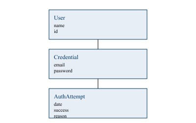

== Introduction 

____
The lecture “Applying Analysis Patterns” explains that large software
systems become easier to maintain when the domain is modeled with
repeatable structural solutions. Instead of hiding behavior inside
functions or UI components, Analysis Patterns expose key domain concepts
explicitly, making the design reusable and extendable. In the Gamified
Gym project, authentication is one of the core behaviors of the system.
Logging in may seem simple on the surface, but it actually involves
multiple domain elements: user identity, credentials, verification,
failures, and security rules. By applying Analysis Patterns, we can
reveal these hidden concepts and create a clear domain model instead of
a single function call.
____

== Domain Concepts in Login 

[width="100%",cols="31%,69%",options="header",]
|===
|*User* a|
____
*The person owning the account*
____

|Credential a|
____
Authentication information (email + password)
____

|Authentication Attempt a|
____
Every time a user tries to log in
____

|Authentication Result a|
____
Outcome: success, failure, or error
____

|===

____
Many apps hide these concepts inside UI logic, making the system harder
to extend. The lecture states that implicit concepts lead to confusion
and duplicated code, so the goal is to make them explicit.
____

== Applying the “Account & Entry” Pattern 

* Account: User identity + Credential
* Entry: Each Login Attempt (date, result, message)

== UML Diagram 

== Code Examples 

=== Credential Class 

____
class Credential \{ constructor(email,

hashedPassword) \{ this.email = email; this.hashedPassword =
hashedPassword;

}

}
____

=== AuthAttempt Class 

____
class AuthAttempt \{

constructor(date, success, reason) \{ this.date = date; this.success =
success; this.reason = reason;

}

}
____

=== User With Attempts 

____
class User \{ constructor(name,

credential) \{ this.name = name; this.credential = credential;
this.history = [];

}

recordAttempt(success, reason = "") \{ const attempt = new
AuthAttempt(new Date(), success, reason); this.history.push(attempt);

}

}
____

== Why This Improves the Design 

* Authentication history becomes visible
* Failed attempts can be counted or blocked
* We can add email verification or MFA without rewriting the login logic
✔ The system gains security features like lockout, audits, and metrics

== Conclusion 

____
Applying Analysis Patterns to Login reveals hidden structure and adds
meaning to the authentication process. With User, Credential, and
AuthAttempt, the Gamified Gym app gains a maintainable and secure
foundation for all future authentication features, following the
lecture’s teaching that explicit models reduce complexity and improve
system design.
____
