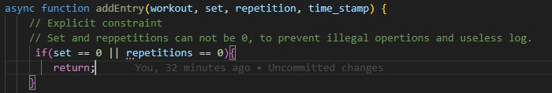
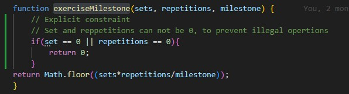

Added explicit constraint to function addEntry from workout_logs.js, now
it does not allow sets or repetition with value 0. This adds clarity on
what can be added as a log.

Added explicit constraint to function exerciseMilestone from
function_exercise_milestone.js, now it does not allow sets or repetition
with value 0. This adds clarity of a valid milestone and prevents
illegal math operations.

Added comments to express explicit constraints more clearly in
updateStreak from frunction_updateStreak.js.
