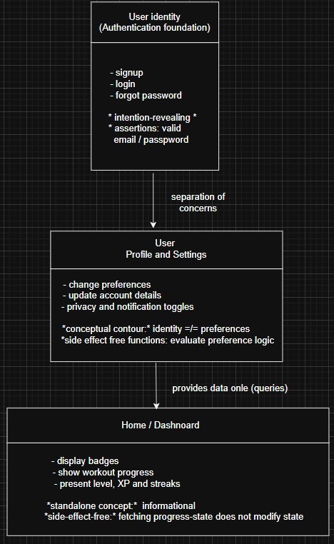

Lecture Topic Task: Applying Supple Design Principles to the Gamified
Gym from a Foundations member

Objective

* To analyze how the Foundations Team’s work on authentication, user
management, and navigation (signup, login, forgot password, settings,
and home pages) could benefit from the Supple Design. We will reflect on
how intention-revealing interfaces, side-effect-free functions,
assertions and conceptual contours can improve the maintainability,
flexibility and clarity of the foundational components in a large-scale
application such as Gamified Gym.

Requirements

* Review the Supple Design material, focusing on:

____
○ Intention-Revealing Interfaces: how naming and structure help
communicate purpose.

○ Side-Effect-Free Functions: how to isolate logic that modifies state
from logic that retrieves information.

○ Assertions and Invariants: how they make system behavior more
predictable and explicit.

○ Conceptual Contours and Standalone Classes: how clear boundaries
between components reduce complexity.
____

* Discuss how these principles apply to the Foundations Team work:

____
○ How can login, signup, and settings components be made more “supple”?

○ What conceptual contours can be identified within the foundational
layer of the app?

○ How could clear interfaces and immutability improve user
authentication and profile management features?

○ Provide examples and reflections using diagrams or written
explanations.
____

* Completion Criteria

____
A written report addressing:
____

* How the Foundations Team design aligns or conflicts with Supple Design
principles.
* Which Supple Design patterns could be introduced to improve cohesion
and reduce coupling.
* A conceptual model such as a diagram or table showing potential
refactoring or reorganization of foundational components under Supple
Design guidelines.
* Demonstrate understanding of theoretical design reasoning.
* Supple Design material

____
○ Intention-revealing in Interfaces in Foundations: We handled the core
pages and implementations of the signup. login, forgot password,
settings, home and index page. Where these features represent the main
user interface and the structural back bone such as the backend
implementation, making the interfaces in this division crucial for the
app.

○ Intention-revealing interfaces emphasize naming and structure that
express what an operation does and not how it was implemented. In our
app, intention-revealing design can help better or strengthen certain
aspects such as:

■ the authentication because there are methods like handleRequest or
processUserInput, should have more expressive names like
authenticateUser, validateCredentials or initiatePasswordReset because
these can show a more clear domain meaning.

■ the settings management by setting up a module for actions such as
updating preferences, viewing account details and modifying the privacy
settings and the security settings because this will reduce the
ambiguity for the developers for them to quickly understand code that
they didn't create.

■ the home and index pages by making interfaces that should communicate
and demonstrate their responsibility or their purposes in the domain.
Like the homepage for the app can have methods such as
loadDashboardData, fetchBadges or retrieveWorkProgress.

● All these things are important because this simplifies the
understanding time period of a new developer on the project and allows
for the modules to have more purpose in the domain.

○ Here are some functions and their roles in the foundations module:

■ authentication logic like verifying passwords, checking if an email
exists or validating the strength of the password can be implemented
because they are concept components of the domain and answer questions
like “does this credential meet the requirements?” or like “does this
user exist?”

■ settings logic like calculating which settings should appear based on
the user type, role or subscription, we should also accept or implement
changes when the user saves the changes

■ progress tracking logic when retrieving the user data such as their
points, their badges or their workout streaks, which can be considered a
query operation, we should consider tasks such as updating the streak or
assigning new achievements as a command

● All these things are important because they provide the code and
project with a cleaner architecture, a more testable and explainable
behavior and creates a foundation that is easier to understand and work
with when there needs to be updated in the future

○ Assertions and invariants in the foundations module

■ the tools to clarify the behavior and prevent hidden side effect are
post-conditions, pre-conditions and invariants

■ some invariants are that a user account must always contain a valid
format, a login attempt must always end in authenticated or rejected, a
settings object must be internally consistent (like a boolean) and a
password result must always verify the user’s identity before changing
the password

■ some assertions are that a pre-condition for signup should be that the
email is not already in use, a post-condition for password rest should
be that the old password becomes invalid and an invariant should be that
every authenticated session must be tied to exactly to one user

○ Conceptual contours in the foundations module

■ user identity: signup, login, forgot password (authentication)

■ user profile and preferences: settings, account modifications
(configuration)

■ home and index: user progress, badges and personalized information
(overview and gamification)

■ good contours can be studied independently, maintains cohesion, avoids
accidental coupling and matches the mental model of the domain ○
Standalone classes and low coupling in foundations

■ some benefits of low coupling are that authentication shouldn’t depend
on gym progress logic, that settings shouldn’t depend on badge ranking
logic and that the home page should not need to know how the credentials
were validated

■ all this ensures that there is independent progress of each domain
aspect, that the rewriting of some feature doesn’t break other features
and that a smaller understanding period of the code for new developers

○ Supple design improves the foundation module

■ clearer domain drive naming reduces the need to study the code or
implementation

■ isolating logic as side effect free functions to make the signup and
login pipeline easier to understand and test

■ explicit assertions prevent future developers from implementing
inconsistent user states or user properties

■ recognizing conceptual contours early prevent entanglements or
conflicts between authentication, settings and dashboard logic

■ standalone low coupled domain object create a cleaner domain model
____

*** Below is attached a diagram that represents a conceptual contour for
the app and shows how the supple design organizes the domain, more
cohesive, more purposeful and separates one from the other to avoid or
reduce coupling ***

____

____
