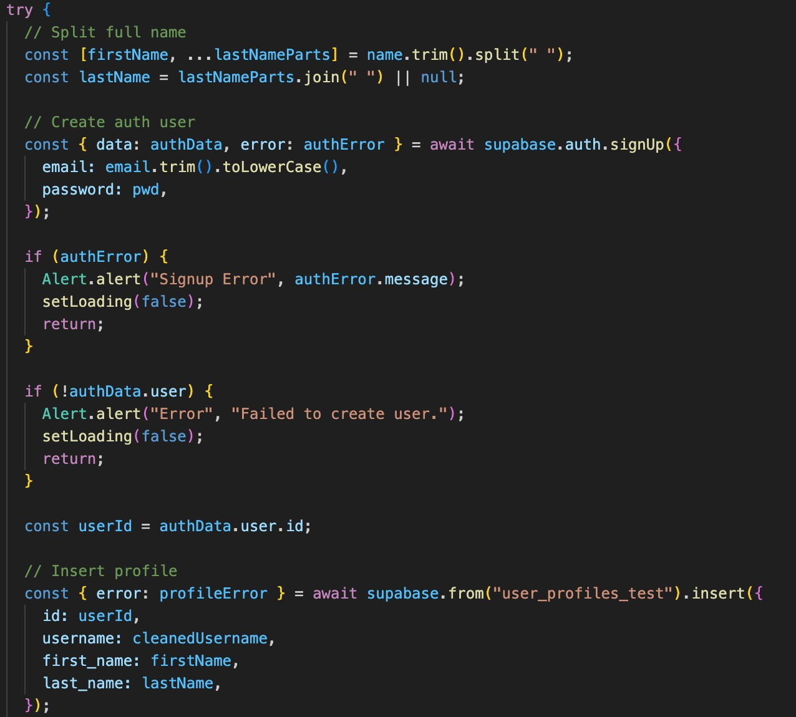

*Lecture Topic Task: Putting the User Domain Model to Work with Supabase
Auth*

*Lecture Reference:* Putting the Domain Model to Work - Marko
Schütz-Schmuck,

*Completed Task:*

* Integrated Sign Up page with Supabase Auth, replacing the old manual
user table.
* Ensured all new users are securely registered with email and password.
* Profile information (username, first name, last name) is stored in
users_profile_test table, linked to the Auth user ID.
* Email confirmation is automatically handled if enabled in Supabase.

*How the Issue Was Implemented / How It Relates to the Lecture:*

[arabic]
. *Domain Model in Code:*
* User object includes email, password, username, first_name, last_name.
o Password validation ensures security standards: +8 characters,
uppercase, lowercase, number, special character.
* Username uniqueness is verified in real-time.
. *Putting the Domain Model to Work, Binding to Supabase Auth:*

____
The Sign Up flow directly maps the User domain model to Supabase:
____

*Connection to Lecture Concepts:*

* *Domain Model and Implementation Linked:* The User model is directly
tied to Supabase Auth, making the model relevant and actionable.
* *Backbone of a Language Used by Team:* The domain model enforces rules
in the app, such as password strength and username uniqueness.
* *Distilled Knowledge / Selective Abstraction:* Only essential fields
are included, ensuring clarity and simplicity in the model.
* *Model Relevance for Maintenance:* Future changes to the user profile
can be easily implemented because the model and implementation are
aligned.

____
{empty}3. *Outcome / Benefits:*
____

* Users can securely create accounts using Supabase Auth.
* Email confirmation works automatically if enabled.
* Login page correctly recognizes registered users.
* The User domain model and implementation are fully aligned, reducing
errors and improving security.

*Why This Matters:*

* Security: Eliminates manual password storage. Auto hashing using
supabase.
* Model Integrity: The domain model drives the actual implementation.
* Reliability: Ensures consistent, maintainable, and extendable user
management.
