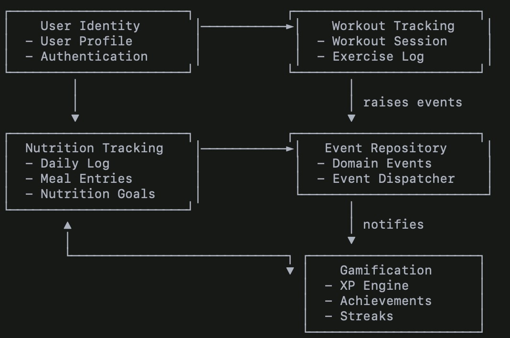

Introduction

This section documents the Bounded Context Map for the Gamified Gym
Application, following the principles from Strategic Design
(Schütz-Schmuck). The system is separated into multiple bounded contexts
to avoid a monolithic and contradictory domain model. Each context
contains its own coherent model with explicit integration points.

The documentation includes:

* A clean context map diagram
* Descriptions of each bounded context
* Relationship patterns (Shared Kernel, Customer–Supplier, etc.)
* Boundary definitions (modules, schemas, APIs)
* Rationale connected to large-scale structure & distillation principles

Bounded Context Map (Diagram)

Bounded Context Descriptions

User Identity Context Responsibilities:

* Authentication
* Account creation
* Profile management

Purpose:

Provides canonical user identity data used across all other contexts.

This context forms part of the Shared Kernel, since user IDs and profile
info are universally referenced.

Workout Tracking Context Responsibilities:

* Workout sessions
* Exercise logs
* Sets, reps, weights

Integration:

* Publishes domain events such as WorkoutCompleted. ● Uses User Identity
data for ownership.

Pattern:

Customer–Supplier (Workout → Event Repository)

Nutrition Tracking Context Responsibilities:

* Daily nutrition logs
* Meal entries
* Calorie/macronutrient totals
* Nutrition goals

Integration:

* Publishes domain events such as DailyNutritionGoalReached. ● Uses User
Identity for record ownership.

Pattern:

Customer–Supplier (Nutrition → Event Repository)

Event Repository Context

Responsibilities:

* Storage of all domain events
* Event dispatching
* Integration hub between contexts

Pattern:

Published Language (events form the universal integration messages)

Gamification Context

Responsibilities:

* XP
* Achievements
* Streaks
* Leveling
* Event-driven progression Integration:
* Subscribes to event stream
* Reacts to domain events from Workout & Nutrition Pattern:

Conformist toward the Published Language of domain events.

Relationship Patterns (Strategic Design)

[width="100%",cols="34%,25%,41%",options="header",]
|===
|Relationship |Pattern a|
____
Reason
____

|User Identity → All |Shared Kernel a|
____
Identity fields must remain consistent
____

|Workout → Event Repo |Customer–Supplier a|
____
Workout emits events; Event Repo ensures delivery
____

|Nutrition → Event Repo |Customer–Supplier a|
____
Same integration pattern
____

|Event Repo → Gamification |Published Language a|
____
Gamification reacts to published events
____

|Workout ↔ Nutrition |Separate Ways a|
____
No direct dependency; independent models
____

|Gamification → None |Conformist a|
____
Consumes events exactly as published
____

|===

Boundaries (Modules, Schemas, APIs)

/contexts

/user_identity

/workout_tracking

/nutrition_tracking

/event_repository

/gamification

[width="100%",cols="38%,62%",options="header",]
|===
|Context a|
____
Tables
____

|User Identity a|
____
users, auth_tokens
____

|Workout Tracking a|
____
workouts, exercises, exercise_logs
____

|Nutrition Tracking a|
____
nutrition_logs, meal_entries
____

|Event Repository a|
____
domain_events, event_queue
____

|Gamification a|
____
achievements, xp_history
____

|===

APIs

* POST /events/workout.completed
* POST /events/nutrition.goal_reached
* GET /events/subscribe

Rationale (Strategic Design Principles Applied)

Avoiding a Monolithic Model

Separating into bounded contexts prevents:

* duplicate concepts
* inconsistent terminology
* hidden coupling

Distillation

Core game logic (gamification) is distilled into its own context,
enhancing clarity.

Large-Scale Structure

Event-driven integration provides a consistent architectural backbone.

Bounded Context Isolation

Each domain has its own model, terminology, and rules, allowing
independent evolution.
