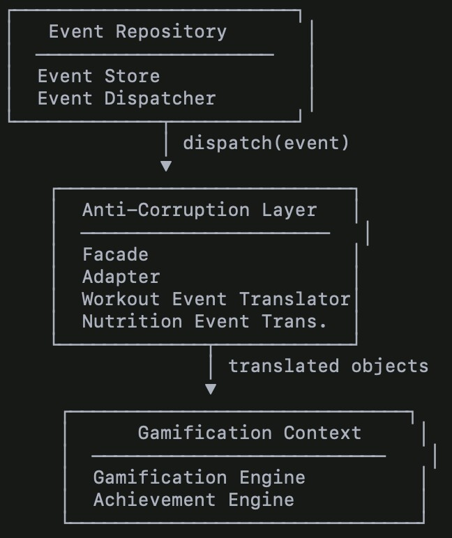
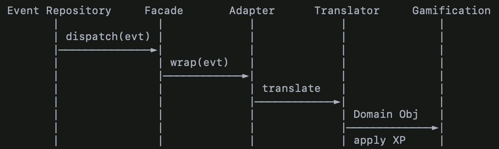

Anti-Corruption Layer (ACL) Documentation

Gamified Gym Application

Introduction

This section documents the Anti-Corruption Layer (ACL) used to integrate
the Event

Repository Context with the Gamification Context in the Gamified Gym
Application. Following the Maintaining Model Integrity lecture, the ACL
prevents conceptual corruption between bounded contexts that use
fundamentally different models.

Contexts Involved & Misalignment

Event Repository Context

* Stores domain events from multiple contexts
* Uses a generic event model
* Provides: eventType, payload, timestamp

Gamification Context

* Evaluates domain actions for XP, achievements, and streaks ● Requires
rich semantic information ● Needs translated domain objects:

____
○ CompletedWorkoutSession

○ DailyNutritionGoalReached
____

Conceptual Misalignments

Splinters

Both contexts talk about “events,” but the meaning differs:

* Event Repo → loosely typed messages
* Gamification → gameplay-relevant domain objects

False Cognates

“goal_reached” means:

* Event Repo: a string label
* Gamification: a domain rule and semantic achievement trigger

An ACL is required to isolate and translate these interpretations.

ACL Design

Components

* Facade — isolates Event Repository internals
* Adapter — reformats raw event messages
* Translators — convert payloads into domain-rich objects
* ACL Service — orchestrates translation → dispatch → gamification
updates ACL Component Diagram

ACL Sequence Diagram

Explanation — How the ACL Preserves Model Integrity

The ACL ensures the Gamification Context never receives:

* raw JSON
* generic payloads
* ambiguous event names
* fields irrelevant to gameplay

Instead, the ACL transforms primitive event messages into pure domain
concepts.

This preserves:

* Ubiquitous Language
* Context Isolation
* Semantic Boundaries
* Model Integrity

It prevents corruption from the Event Repository’s generic model.

Integration With the Context Map

Event Repository Context ───▶ (ACL) ───▶ Gamification Context This
ensures:

* Event Repository keeps its role as neutral event infrastructure
* Gamification keeps its expressive game domain
* The ACL performs translation in between

Before vs After Summary

Before

* Gamification consumed raw events
* Domain rules relied on string comparisons
* Risk of corruption through false cognates

After

* ACL sits between contexts
* Raw events → Domain Objects via translators
* Gamification stays fully isolated and expressive
