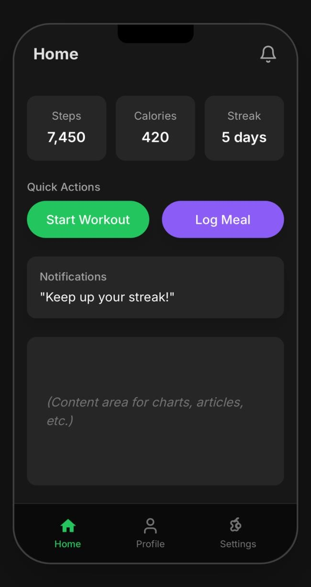

*The Nature of the Design Process in*

*Gamified Gym*

Foundations Team – UI/UX (Home, Profile, Settings)

== Core Challenge: Envisioning a Future State 

As Professor Marko emphasized in his lecture on The Nature of the Design
Process, the fundamental problem of design lies in envisioning a desired
outcome that only comes into being if the design is correct. For the
Foundations Team, this translates into anticipating how users will
interact with the Home, Profile, and Settings screens of Gamified Gym.
The challenge is not only to predict how users might navigate these
pages, but also to ensure that the experience is intuitive,
motivational, and sustainable. For example, when designing the Home page
dashboard, we must assume that users prefer quick access to progress
metrics (steps, calories, streaks) and will be discouraged by cluttered
or confusing layouts.

== Role of Design Activity: Modularity and Quality 

Modularity is essential in structuring the Foundations Team’s work. Each
screen — Home, Profile, Settings — is a distinct module, yet together
they create the foundational UI framework of the app. The Home page
functions as the user’s control center, the Profile reflects long-term
progress and identity, and the Settings page ensures personalization and
control. Designing them as modular components makes it easier to update
or extend functionality (e.g., adding new workout types or notification
options) without disrupting the rest of the system.

Quality, as Schütz highlighted, is both elusive and essential. In our
scope, quality means usability, accessibility, and consistency. For
instance, consistent typography and iconography across the Profile and
Settings screens reinforce user trust, while ensuring that settings are
clearly labeled prevents user frustration.

== Communication: Gathering Requirements 

The design process depends on communication with both stakeholders and
end-users. To refine the UI/UX requirements, we would ask:

[arabic]
. What information do you expect to see immediately when opening the
app?
. How much control do you want over customizing your Profile and Home
dashboard?
. Which settings (e.g., notifications, privacy, integrations) are most
important for your daily use?

These questions are designed to uncover not just functional requirements
but also motivational and psychological needs, which directly shape
interface design.

== Domain Knowledge: Acquiring Expertise 

UI/UX design requires integrating domain knowledge from multiple
sources. First, usability heuristics (Nielsen’s principles) ensure the
design avoids common pitfalls such as hidden navigation or poor error
recovery. Second, accessibility standards (WCAG) guarantee inclusivity,
allowing users of varying abilities to interact with the app
effectively. Finally, reviewing fitness app design conventions (e.g.,
Fitbit, Strava) informs decisions about dashboard layouts and progress
visualization, ensuring users encounter familiar, intuitive patterns.

[width="99%",cols="34%,33%,33%",options="header",]
|===
|Knowledge Area |Source |Importance
|Usability heuristics |HCI Research |Prevents common design flaws and
improves intuitiveness

|Accessibility guidelines |WCAG Standards |Ensures inclusivity for users
with diverse needs

|Fitness app practices |Market analysis a|
Provides familiarity and benchmarks for dashboard

design

|===

_Table 1.1_

By grounding our work in established principles and industry practices,
we avoid reinventing the wheel while ensuring that Gamified Gym remains
distinctive.

== Design Outline: UI Components and Connections 

The design of the Foundations Team can be conceptualized as a set of
reusable components:

* Home: Dashboard cards (Steps, Calories, Streaks), Quick Actions,
Notification Preview.
* Profile: Profile Header (user identity), Achievement Badges, Progress
History (graphs).
* Settings: Toggles (notifications, privacy), Integration Options
(Google Fit, Apple Health), Account Management.

These components are bound together by a shared navigation system and
consistent design language. Reusability is central: a card widget
designed for the Home screen can also appear in Profile summaries, and a
toggle switch designed for Settings can be reused across multiple
contexts.

*_Foundations Team UI_*

*_├─ Home_*

*_│ ├─ DashboardCard (Steps)_*

*_│ ├─ DashboardCard (Calories)_*

*_│ ├─ DashboardCard (Streak)_*

*_│ └─ QuickActionButton_*

*_├─ Profile_*

*_│ ├─ ProfileHeader_*

*_│ ├─ AchievementCard_*

*_│ └─ ProgressGraph_*

*_└─ Settings_*

*_├─ ToggleSwitch_*

*_└─ AccountControls_*

_Diagram 1.1_

== Process Planning: Implementation and Integration 

A staged process ensures both clarity and efficiency:

[arabic]
. Wireframing and mockups in Figma for Home, Profile, and Settings.
. Interactive prototypes tested for navigation and usability.
. Frontend implementation using reusable UI components in React Native
or Flutter.
. Integration with backend services, beginning with fitness tracking,
followed by gamification features.
. Usability testing and iteration, refining based on feedback.

Integration with other teams is crucial: the Home screen must display
tracking data, while the Profile must display gamification achievements.
Delivering placeholder UI elements early allows parallel development,
ensuring smoother integration later.

== Problem-Solving: Design Criteria 

The Foundations Team applies clear design criteria to guide decisions:

* Usability: The interface must be simple and predictable.
* Inclusivity: Accessible features such as scalable text and
high-contrast themes.
* Adaptability: Flexible layouts for new features and content.
* Engagement: Visual design that motivates continued app use.

____

____

_Figure 1.1_

For instance, the decision to use card-based widgets on the Home page
was driven by usability (scan-friendly layout) and adaptability (new
cards can be added with minimal redesign).

== Designer’s Tools: Patterns and Methods 

Designers rely on tools and patterns to balance abstraction with
practical execution. Wireframing in Canvas provides an abstract but
testable representation of the UI, allowing early feedback without heavy
coding investment. On the implementation side, the Factory Pattern
supports the creation of reusable UI components such as dashboard cards
and toggle switches. This ensures consistency and reduces redundancy in
code, while also aligning with modular principles. *Risks of Poor
Design*

Failure to apply theoretical principles in practice carries significant
risks:

* Confusing navigation may lead to frustration and app abandonment.
* Inaccessible settings could exclude users with disabilities.
* Overly cluttered dashboards might overwhelm users, reducing
motivation.

These risks highlight why a design process grounded in theory,
communication, and domain knowledge is essential for long-term success.

== Conclusion 

The Foundations Team’s work on the Home, Profile, and Settings screens
of Gamified Gym exemplifies how abstract design theory informs concrete
design choices. By working backward from an envisioned future state — a
motivating, accessible, and engaging fitness experience — and applying
principles such as modularity, communication, and problem-solving, we
create an interface that supports both user motivation and team
integration. The success of the app ultimately depends on these
foundational design decisions, demonstrating the profound importance of
the design process in shaping usable, reliable, and engaging software.
